## {#bienvenue .title-slide .hero-slide background-color="#fbfaf7"}

STT-1100 · Automne 2026

<h1>Introduction à la science des données</h1>

Des données brutes aux décisions responsables.

Aurélien Nicosia · Université Laval

::: {.notes}
Ouvrir avec la promesse du cours. Ne pas commencer par l'administration. Demander aux étudiantes et étudiants ce qu'ils pensent pouvoir produire à partir d'un tableau brut.

Sources internes: index.qmd; _quarto.yml.
:::

## Un tableau ne devient pas une décision tout seul {.statement-slide}

Que faut-il faire entre...

datevaleurrégion
2026-09-01NAQuébec
01/09/2642Quebec
2026-09-014200québec

→

une analyse fiable
une histoire claire
une décision défendable

C'est exactement le travail que nous allons apprendre à faire.

::: {.notes}
Faire émerger les gestes: comprendre, nettoyer, visualiser, modéliser, communiquer, vérifier.
:::

## Vous allez pratiquer le métier, pas seulement le vocabulaire

01Comprendrela question et les données

02Préparerun jeu de données fiable

03Explorerles motifs et les relations

04Communiqueravec clarté et prudence

À la fin du cours, vous saurez produire une analyse reproductible que vous pouvez expliquer, vérifier et défendre.

::: {.notes}
Source interne: page d'accueil et objectifs des dix modules.
:::

## Chaque module vous confie une mission

Une personne a besoin de votre analyse.

Les données ne sont pas parfaites.

Votre conclusion aura des conséquences.

scientifique de données

journaliste de données

ingénieur·e de données

statisticien·ne

consultant·e

analyste d'affaires

Le rôle change. L'exigence reste la même: rendre votre démarche compréhensible.

::: {.notes}
Les rôles viennent des aventures des modules 1 à 10. Insister sur l'immersion comme moyen pédagogique, pas comme simple décoration.
:::

## Une semaine suit un rythme que vous reconnaîtrez vite

1<h3>Plan</h3>
Se repérer

2<h3>Lectures</h3>
Préparer les idées

3<h3>Mini-test</h3>
S'autoévaluer

4<h3>Aventure</h3>
Pratiquer en classe

5<h3>Défi</h3>
Produire en autonomie

6<h3>Exercices</h3>
Consolider autrement

Vous savez toujours où commencer, quoi produire et comment vérifier votre progression.

::: {.notes}
Source interne: demarrage.qmd et modules.qmd. Préciser que le mini-test est formatif et que les exercices utilisent d'autres contextes.
:::

## Trois activités, trois fonctions

Aventure

<h3>Apprendre dans une situation</h3>

Un rôle, des données, une personne à aider et un parcours guidé.

Défi

<h3>Montrer votre autonomie</h3>

Une production ciblée qui prolonge l'aventure et demande des choix personnels.

Exercices

<h3>Stabiliser les réflexes</h3>

D'autres contextes et d'autres données pour pratiquer sans répéter le défi.

::: {.notes}
Source interne: demarrage.qmd, section « Trois pièces, trois fonctions ».
:::

## Dix modules, un seul parcours

Modules 1 à 3<h3>Entrer dans la pratique</h3>
R, Quarto, GitHub, visualisation et catégories

Modules 4 à 6<h3>Fiabiliser le travail</h3>
Nettoyage, relations, jointures et collaboration

Modules 7 et 8<h3>Agir avec responsabilité</h3>
Éthique, confidentialité et automatisation prudente

Modules 9 et 10<h3>Partager avec jugement</h3>
Prédiction, biais, texte et tableau de bord

La technique progresse. Votre autonomie et votre responsabilité aussi.

::: {.notes}
Source interne: modules.qmd et demarrage.qmd.
:::

## 1 à 3 · Démarrer, organiser, raconter {.phase-slide .phase-one}

01<h3>Premier rapport</h3>
RStudio, R, Quarto et données météo
<small>Produit: mini-rapport HTML reproductible</small>

02<h3>Projet versionné</h3>
GitHub, Excel et visualisations lisibles
<small>Produit: dépôt et journal de bord</small>

03<h3>Article de données</h3>
Chaînes, catégories et infractions alimentaires
<small>Produit: article Quarto illustré</small>

Vous passez d'un tableau à une analyse que quelqu'un d'autre peut relire.

::: {.notes}
Sources internes: module_01/index.qmd, module_02/index.qmd, module_03/index.qmd.
:::

## 4 à 6 · Nettoyer, explorer, collaborer {.phase-slide .phase-two}

04<h3>Données fiables</h3>
CSV, Excel, JSON, erreurs et recodage
<small>Produit: données propres et journal de nettoyage</small>

05<h3>Relations prudentes</h3>
Dates, corrélations et retards de vols
<small>Produit: rapport exploratoire argumenté</small>

06<h3>Travail d'équipe</h3>
Jointures, GitHub et revue croisée
<small>Produit: rapport collaboratif reproductible</small>

Vous apprenez à laisser une trace claire de vos décisions et de votre collaboration.

::: {.notes}
Sources internes: module_04/index.qmd, module_05/index.qmd, module_06/index.qmd.
:::

## 7 et 8 · Protéger et automatiser {.phase-slide .phase-three}

07<h3>Science des données responsable</h3>
Visualisation honnête, anonymisation, éthique et confidentialité
<small>Produit: note éthique, données protégées et figures corrigées</small>

08<h3>Automatisation prudente</h3>
Fonctions, boucles, extraction web et limites de la collecte
<small>Produit: fonction <code>scrape_page()</code> robuste et testable</small>

Pouvoir faire quelque chose avec des données ne signifie pas toujours qu'il faut le faire.

::: {.notes}
Sources internes: module_07/index.qmd, module_08/index.qmd.
:::

## 9 et 10 · Prédire et partager {.phase-slide .phase-four}

09<h3>Prédiction et biais</h3>
Régression, erreurs, limites et recommandation prudente
<small>Produit: capsule vidéo de 180 secondes</small>

10<h3>Texte et interaction</h3>
Analyse textuelle, visualisation et tableau de bord
<small>Produit: tableau de bord interactif local</small>

Le résultat compte. La manière de l'expliquer et d'en reconnaître les limites compte autant.

::: {.notes}
Sources internes: module_09/index.qmd, module_10/index.qmd.
:::

## À la fin, votre dossier ne contiendra pas que du code

rapports Quarto
données nettoyées
visualisations
journal de décisions
dépôts GitHub
article de données
fonction testable
capsule vidéo
tableau de bord

Vous construisez des preuves visibles de ce que vous savez faire.

::: {.notes}
Source interne: produits finis annoncés dans les pages des dix modules.
:::

## Des données proches de vraies décisions

Le cours privilégie des données réelles, souvent québécoises, quand elles servent clairement l'apprentissage.

Météo, services municipaux, alimentation, équipements publics, éducation, eau potable et données ouvertes.

MeteoQuebec

Montréal

Sherbrooke

Données Québec

Écoles du Québec

Municipalités

Quand une donnée est fictive, elle est annoncée comme telle et utilisée pour apprendre sans exposer de personnes réelles.

::: {.notes}
Sources internes: donnees.qmd; fichiers et descriptions des modules 1, 3, 4, 7, 8, 9 et 10.
:::

## Vos outils forment un seul atelier

R<h3>Analyser</h3>
Importer, transformer, visualiser et modéliser.

RStudio<h3>Organiser</h3>
Écrire le code et travailler dans le bon projet.

Quarto<h3>Rendre</h3>
Réunir code, résultats et explications dans un document.

GitHub<h3>Tracer</h3>
Versionner, collaborer et partager une production.

Le bon outil est celui qui rend votre démarche plus claire et plus reproductible.

::: {.notes}
Source interne: demarrage.qmd et boite_outils.qmd.
:::

## L'évaluation suit votre progression

Pratiquer<h3>Mini-tests, aventures et exercices</h3>
Repérer les incompréhensions avant une remise.

Produire<h3>Défis</h3>
Livrables courts avec une autonomie croissante.

Intégrer seul<h3>Examen</h3>
Situation appliquée couvrant les modules 1 à 4.

Communiquer<h3>Affiche</h3>
Histoire visuelle en équipe à partir de données réelles.

Mener un projet<h3>Projet de session</h3>
Question, données, analyse, dépôt, présentation et résumé final.

Brio confirme les pondérations, les dates, les remises et les modalités administratives.

::: {.notes}
Sources internes: evaluations.qmd, examen.qmd, affiche_litteratie_donnees.qmd, projet_session/index.qmd.
:::

## Les grands rendez-vous de l'automne 2026

31 août<h3>Première séance</h3>
Module 1 et premier rapport Quarto

19 octobre<h3>Examen en classe</h3>
Intégration des modules 1 à 4

22 novembre<h3>Affiche</h3>
Communication visuelle à partir de données réelles

14 décembre<h3>Présentations du projet</h3>
Dernière séance, de 8 h 30 à 11 h 20

Consultez Brio avant chaque remise. En cas de différence, la consigne officielle de la session prévaut.

::: {.notes}
Sources internes: calendrier.qmd; affiche_litteratie_donnees.qmd; projet_session/index.qmd. La présentation du projet est annoncée au local PLT-2325 sur le site.
:::

## L'IA peut aider. Elle ne peut pas assumer vos choix.

01<h3>Demander</h3>
Une explication, une piste de débogage, une rétroaction ou une vérification.

02<h3>Comprendre</h3>
Ne gardez aucune suggestion que vous ne pouvez pas expliquer avec vos mots.

03<h3>Tester</h3>
Exécutez le code et comparez la réponse aux données et à la consigne.

04<h3>Déclarer</h3>
Gardez une trace lorsque l'aide influence une partie importante du livrable.

Vous demeurez responsable de chaque ligne de code, de chaque résultat et de chaque conclusion remis.

::: {.notes}
Source interne: ia.qmd. Insister sur la responsabilité de la personne qui remet le travail. Faire préciser comment une suggestion peut être vérifiée avant de passer à la diapositive suivante.
:::

## GPT STT-1100 vous aide à apprendre, pas à déléguer

Assistant officiel du cours

<h3>Un point d'entrée pour comprendre, pratiquer et vous débloquer</h3>

Le GPT connaît les ressources publiques du cours. Il vous guide vers la bonne source, pose des questions de diagnostic et propose des vérifications à faire vous-même.

<a class="gpt-qr" href="https://chatgpt.com/g/g-682d165f32e881918633affa3fe9dfd6-gpt-stt-1100" target="_blank" rel="noopener"><strong>Ouvrir GPT STT-1100</strong><small>Assistant conversationnel</small></a>
<a class="gpt-qr" href="../../ia.html" target="_blank"><strong>Lire IA et aide</strong><small>Règles et exemples</small></a>

Commencez par le mode qui correspond à votre besoin.

<code>/sources</code>retrouver la règle qui fait foi

<code>/revision</code>revoir une notion

<code>/exercices</code>pratiquer avec des indices

<code>/retroaction</code>améliorer votre travail

<code>/debug-r</code>diagnostiquer une erreur R

<code>/projet</code>comparer et justifier des choix

<code>/examen</code>préparer votre révision

<code>/integrite-ia</code>clarifier un usage permis

::: {.notes}
Source interne: ia.qmd. Ouvrir le GPT ou faire lire le code QR. Démonstration suggérée: « /debug-r Voici mon message d'erreur complet, mon code minimal et ce que je voulais obtenir. Aide-moi à trouver la cause probable, puis donne une vérification à faire moi-même. » Le GPT n'a pas accès à Brio; Brio demeure la source officielle pour les dates, pondérations et modalités.
:::

## Trois niveaux d'utilisation, selon l'activité

Ouvert

Apprentissage formatif
<h3>Aventures, mini-tests et exercices</h3>

Usage encouragé pour comprendre, pratiquer, déboguer et obtenir une autre explication.

Encadré

Travaux évalués
<h3>Défis et projet de session</h3>

Autorisé avec restrictions: comprendre, vérifier, protéger les données et déclarer l'usage selon la consigne.

Interdit

Évaluation individuelle
<h3>Examen en classe</h3>

L'utilisation de l'intelligence artificielle générative est interdite pendant l'examen individuel.

Une consigne particulière affichée dans l'évaluation Brio a toujours préséance.

::: {.notes}
Sources internes: ia.qmd; Brio, section « Utilisation d'outils d'intelligence artificielle ». Distinguer clairement le travail formatif, les productions évaluées avec restrictions et l'examen individuel. Pour les défis et le projet, rappeler qu'aucune donnée personnelle, confidentielle ou protégée ne doit être transmise à un outil d'IA.
:::

## Quatre espaces, quatre usages

BrioConfirmerDates, remises, pondérations et annonces officielles

Site du coursApprendrePlans, lectures, mini-tests, aventures, défis, données et ressources

GitHubProduireGabarits, versions, collaboration et traces de travail

GPT STT-1100Se débloquerExplications, diagnostic et vérifications, sans faire le travail à votre place

::: {.notes}
Sources internes: demarrage.qmd, ia.qmd et ressources.qmd.
:::

## La routine qui évite la plupart des mauvaises surprises

01
Ouvrir le bon projet

02
Lire la consigne avant de coder

03
Exécuter par petites étapes

04
Rendre le document Quarto

05
Vérifier données, figures et conclusion

06
Conserver une trace claire

<blockquote class="success-quote">Un travail simple, vérifié et bien expliqué vaut mieux qu'un travail spectaculaire que vous ne pouvez pas défendre.</blockquote>

::: {.notes}
Sources internes: demarrage.qmd et boite_outils.qmd.
:::

## Votre première mission commence maintenant {.action-slide}

01

<h3>Ouvrir le site du cours</h3>

Repérez Démarrage, Calendrier, Modules et Boîte à outils.

02

<h3>Vérifier votre atelier</h3>

R, RStudio, Quarto et les packages R de départ doivent être prêts.

03

<h3>Produire une première trace</h3>

Ouvrez le module 1 et rendez votre premier document Quarto.

<a href="https://aureliennicosiaulaval.github.io/STT-1100_notes_de_cours/">aureliennicosiaulaval.github.io/STT-1100_notes_de_cours</a>

::: {.notes}
Source interne: demarrage.qmd. Faire réaliser ces actions en classe si le temps le permet.
:::

## {#bienvenue-au-laboratoire .closing-slide background-color="#202124"}

STT-1100

<h2>Bienvenue dans le laboratoire.</h2>

Cette session, vous allez apprendre à faire parler les données sans leur faire dire n'importe quoi.

Soyez curieux. Soyez rigoureux. Gardez une trace.

::: {.notes}
Fermer en revenant à la promesse d'ouverture: une analyse fiable, claire et responsable.
:::
