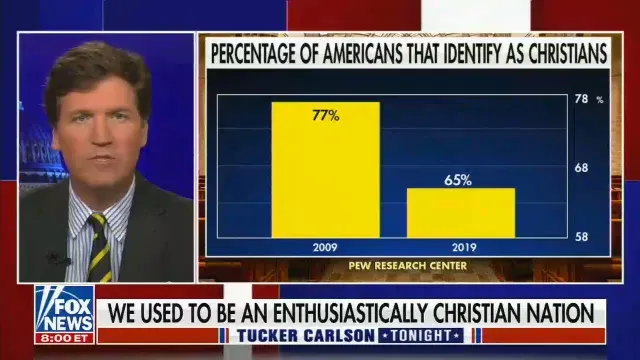
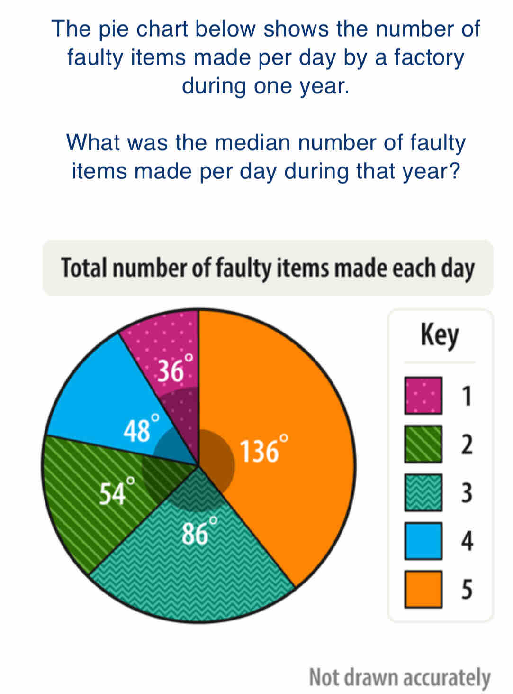

# Consolidation Exercises

# Consolidation Exercises

Here are some examples of problematic or controversial visualizations to analyze.

## 1. Truncated Axis in a Television Chart

The image shows a chart about the percentage of Americans who identify as Christians. The vertical axis does not start at zero, which visually amplifies the difference between 2009 and 2019.

Television chart with a truncated vertical axis about religious identification in the United States

**Question**: How can the axis shape mislead the reader? How could this comparison be represented more honestly?

## 2. Pie Chart Not Drawn to Scale

The image shows a pie chart with angles written on it, but the drawing itself is not to scale. The chart also asks a median question, which is not natural to answer from a pie chart.

Pie chart displaying angles and stating that the drawing is not to scale

**Question**: What might be misinterpreted from this chart? What chart type would better support comparisons across days or finding a median?

## 3. Electoral Map and Area Perception

Large, sparsely populated areas can visually dominate a map, even if they represent few voters. A population-weighted map or cartogram can sometimes support the message better.

United States electoral map illustrating visual distortion by geographic area

**Question**: Why can geographic size distort the perception of results? How could it be improved?

## 4. Truncated Vertical Axis

Two versions of the same chart, one honest and one manipulated through axis truncation, reveal the impact of visual choices.

Two charts comparing the effect of a truncated vertical axis

**Question**: What do you notice when comparing the two versions? What different messages are conveyed?

## 5. Cambridge Analytica

Facebook data were used without users’ knowledge for profiling and political persuasion.

<https://en.wikipedia.org/wiki/Facebook%E2%80%93Cambridge_Analytica_data_scandal>

**Question**: Which ethical principles are violated here, such as transparency, consent, minimization or anonymization? How can this type of misuse be prevented?
