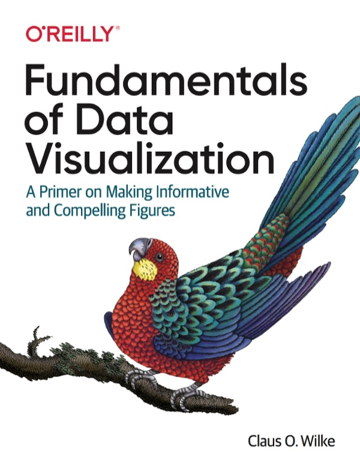

Références du cours

# Livres et lectures

Les lectures du cours renvoient vers des ressources ouvertes et durables. Les livres sont séparés des sites web, guides, articles et aides de fonctions.

[Livres](#livres) [Autres lectures et aides](#autres-lectures) [Lectures par module](#lectures-par-module)

  

## Livres

Ces livres peuvent servir de références de fond pour R, la statistique, la visualisation, la reproductibilité et le projet de session.

Wickham, Çetinkaya-Rundel et Grolemund

### R for Data Science, 2e édition

Référence principale pour le tidyverse, l'importation, la transformation, la visualisation, les dates, les jointures et la communication.

[Ouvrir le livre](https://r4ds.hadley.nz/)

Çetinkaya-Rundel et Hardin

### Introduction to Modern Statistics

Complément pour l'exploration numérique, l'inférence, l'intuition statistique et l'interprétation appliquée.

[Ouvrir le livre](https://openintrostat.github.io/ims/)

Diez, Cetinkaya-Rundel et Barr

### OpenIntro Statistics

Référence ouverte pour revoir les bases statistiques et les raisonnements d'incertitude.

[Ouvrir la ressource](https://www.openintro.org/book/os/)

Silge et Robinson

### Text Mining with R

Référence du module 10 pour transformer du texte en données tidy, compter des mots et construire des analyses lexicales.

[Ouvrir le livre](https://www.tidytextmining.com/)

Bryan, STAT 545 TAs et Hester

### Happy Git and GitHub for the useR

Guide pratique pour connecter RStudio, Git et GitHub, comprendre les commits, pousser le travail et collaborer dans un dépôt.

[Ouvrir le livre](https://happygitwithr.com/)

Alexander

### Telling Stories with Data

Référence pour construire une analyse complète: question, données, préparation, modélisation, communication et démarche reproductible.

[Ouvrir le livre](https://rohanalexander.github.io/telling_stories-published/)

Ismay, Kim et Valdivia

### Statistical Inference via Data Science

Complément pour relier visualisation, transformation, régression et raisonnement statistique avec les outils tidyverse.

[Ouvrir le livre](https://moderndive.com/v2/)

Chang

### R Graphics Cookbook, 2e édition

Recettes concrètes pour améliorer des graphiques ggplot2 sans devoir relire toute la théorie à chaque blocage.

[Ouvrir le livre](https://r-graphics.org/)

Wilke

### Fundamentals of Data Visualization

Référence ouverte pour choisir des graphiques adaptés et repérer les choix visuels fragiles.

[Ouvrir le livre](https://clauswilke.com/dataviz/)

## Autres lectures et aides

Cette section regroupe les sites web, articles, guides, documentations et aides de fonctions qui soutiennent des gestes précis.

Data
Org

Broman et Woo

### Data Organization in Spreadsheets

Article de référence pour structurer un tableur avant l'importation, garder les données brutes intactes et documenter les corrections.

[Ouvrir l'article](https://www.tandfonline.com/doi/full/10.1080/00031305.2017.1375989)

tidytext
tokens

tidytext

### Documentation unnest_tokens()

Documentation de la fonction qui transforme une colonne de texte en tokens dans un tableau tidy.

[Ouvrir la documentation](https://juliasilge.github.io/tidytext/reference/unnest_tokens.html)

tidytext
TF-IDF

tidytext

### Documentation bind_tf_idf()

Documentation de la fonction qui calcule et ajoute TF, IDF et TF-IDF à un tableau de comptes.

[Ouvrir la documentation](https://juliasilge.github.io/tidytext/reference/bind_tf_idf.html)

flex
dashboard

Posit

### Documentation flexdashboard

Documentation pour organiser plusieurs visualisations et sorties R dans une page de tableau de bord.

[Ouvrir la documentation](https://rmarkdown.rstudio.com/flexdashboard/)

Shiny
Dash

Posit

### Using Shiny with flexdashboard

Guide court pour ajouter des entrées interactives et des sorties réactives dans un tableau de bord flexdashboard.

[Ouvrir le guide](https://rstudio.github.io/flexdashboard/articles/shiny.html)

Shiny
Basics

Posit

### Shiny Basics

Introduction à la structure d'une application interactive et au rôle des entrées et sorties réactives.

[Ouvrir la ressource](https://shiny.posit.co/r/getstarted/shiny-basics/lesson1/)

Tidyverse
Style

Tidyverse

### The Tidyverse Style Guide

Guide pour écrire du code R lisible, cohérent et plus facile à réviser.

[Ouvrir le guide](https://style.tidyverse.org/)

Quarto
Docs

Posit

### Documentation Quarto

Documentation officielle pour créer, rendre et publier des documents, rapports et sites Quarto.

[Ouvrir la documentation](https://quarto.org/docs/)

GitHub
Docs

GitHub

### GitHub Docs

Documentation officielle pour les dépôts, commits, branches, issues et workflows GitHub.

[Ouvrir la documentation](https://docs.github.com/)

rvest
Docs

Tidyverse

### Documentation rvest

Documentation officielle pour lire une page HTML, sélectionner des éléments, extraire du texte et convertir des tableaux.

[Ouvrir la documentation](https://rvest.tidyverse.org/)

MDN
robots

MDN Web Docs

### robots.txt

Repère technique pour comprendre le rôle d'un fichier robots.txt dans les consignes données aux robots d'exploration.

[Ouvrir la ressource](https://developer.mozilla.org/en-US/docs/Glossary/Robots.txt)

Google
robots

Google Search Central

### Introduction to robots.txt

Guide complémentaire pour situer ce que robots.txt peut et ne peut pas contrôler dans l'exploration web.

[Ouvrir la ressource](https://developers.google.com/search/docs/crawling-indexing/robots/intro)

robotstxt
R

rOpenSci

### Documentation robotstxt

Documentation du package R utilisé pour vérifier si un chemin est autorisé par les règles robots.txt d'un site.

[Ouvrir la documentation](https://docs.ropensci.org/robotstxt/)

R
lm

R Core Team

### Documentation lm()

Documentation de la fonction R qui ajuste des modèles linéaires et sert de base aux prédictions du module 9.

[Ouvrir la documentation](https://stat.ethz.ch/R-manual/R-devel/library/stats/html/lm.html)

R
predict

R Core Team

### Documentation predict.lm()

Documentation de la méthode R qui produit des prédictions à partir d'un modèle linéaire ajusté.

[Ouvrir la documentation](https://stat.ethz.ch/R-manual/R-devel/library/stats/html/predict.lm.html)

Canada
ADM

Gouvernement du Canada

### Guide sur la prise de décisions automatisée

Repère institutionnel pour discuter la transparence, la responsabilité et les limites des systèmes de décision automatisée.

[Ouvrir le guide](https://www.canada.ca/en/government/system/digital-government/digital-government-innovations/responsible-use-ai/guide-scope-directive-automated-decision-making.html)

NIST
Bias

Schwartz et al.

### NIST SP 1270

Référence pour identifier et gérer les biais possibles dans les systèmes d'intelligence artificielle.

[Ouvrir la ressource](https://www.nist.gov/publications/towards-standard-identifying-and-managing-bias-artificial-intelligence)

RSS
Guide

Royal Statistical Society

### Best Practices for Data Visualisation

Guide pratique pour rendre les graphiques lisibles, honnêtes et adaptés au message statistique.

[Ouvrir le guide](https://royal-statistical-society.github.io/datavisguide/RSS-data-vis-guide.pdf)

QC
Données

Gouvernement du Québec

### Anonymisation

Repères institutionnels pour discuter les renseignements personnels, la protection et la publication de données.

[Ouvrir la ressource](https://www.quebec.ca/gouvernement/travailler-gouvernement/normes-gouvernance-pratiques-internes/protection-des-renseignements-personnels/anonymisation)

CNIL
Guide

CNIL

### L'anonymisation de données personnelles

Référence utile pour distinguer anonymisation, pseudonymisation et risques résiduels.

[Ouvrir la ressource](https://www.cnil.fr/fr/technologies/lanonymisation-de-donnees-personnelles)

FAIR
Data

Wilkinson et al.

### FAIR Guiding Principles

Article de référence sur les principes Findable, Accessible, Interoperable et Reusable.

[Ouvrir l'article](https://www.nature.com/articles/sdata201618)

## Lectures par module et projet

Cette synthèse aide à retrouver rapidement les références appelées dans les plans d'apprentissage et les ressources utiles pour le projet de session.

### Module 01

[R for Data Science](#r4ds) pour situer le flux de travail et [Quarto](#quarto-docs) pour comprendre le rapport HTML.

### Module 02

[R for Data Science](#r4ds) pour visualisation, transformation, exploration et tableurs; [Broman et Woo](#dataorg-spreadsheets) pour organiser les fichiers Excel avant l'analyse.

### Module 03

R for Data Science: chaînes de caractères, facteurs, recodage et repères pour les variables catégorielles.

### Module 04

[R for Data Science](#r4ds) pour importation, données tidy, valeurs manquantes, facteurs, tableurs, JSON et données imbriquées; [Broman et Woo](#dataorg-spreadsheets) pour les fichiers tabulaires.

### Module 05

[R for Data Science](#r4ds) pour EDA, dates, visualisation et valeurs manquantes; [Introduction to Modern Statistics](#ims) pour l'exploration numérique; [R Graphics Cookbook](#r-graphics-cookbook) pour raffiner un graphique.

### Module 06

[GitHub Docs](#github-docs) et [Happy Git](#happy-git) pour dépôts, issues, pull requests et conflits; Quarto pour code inline et options d'exécution; R for Data Science pour les jointures.

### Module 07

[R for Data Science](#r4ds) pour la communication, [Wilke](#wilke-dataviz), le [guide RSS](#rss-dataviz) et [R Graphics Cookbook](#r-graphics-cookbook) pour la visualisation responsable, puis [Québec](#quebec-anonymisation), [CNIL](#cnil-anonymisation) et [FAIR](#fair-principles) pour l'anonymisation et la réutilisation des données.

### Module 08

[R for Data Science](#r4ds) pour HTML, fonctions et itération, [rvest](#rvest-docs) pour l'extraction, puis [MDN](#mdn-robots), [Google Search Central](#google-robots) et [robotstxt](#robotstxt-docs) pour les limites de collecte.

### Module 09

[Introduction to Modern Statistics](#ims) et [ModernDive](#moderndive) pour la régression simple et multiple, [lm()](#r-lm-docs) et [predict.lm()](#r-predict-lm-docs) pour l'implémentation R, puis le [guide du Canada](#canada-adm-guide) et [NIST SP 1270](#nist-bias-ai) pour la discussion des biais et des décisions automatisées.

### Module 10

[Text Mining with R](#tidytext) pour le format tidy text, le sentiment et le TF-IDF, [unnest_tokens()](#tidytext-unnest-tokens) et [bind_tf_idf()](#tidytext-bind-tfidf) pour les fonctions clés, puis [flexdashboard](#flexdashboard-docs), [Shiny avec flexdashboard](#flexdashboard-shiny) et [Shiny Basics](#shiny-basics) pour le tableau de bord interactif.

### Projet de session

[Telling Stories with Data](#telling-stories-data) pour la démarche complète, [Happy Git](#happy-git) pour le dépôt, [Broman et Woo](#dataorg-spreadsheets) pour les données tabulaires et [Quarto](#quarto-docs) pour la communication reproductible.

## Sources des visuels

Les couvertures reprises ici servent à reconnaître rapidement les ressources principales du cours.
