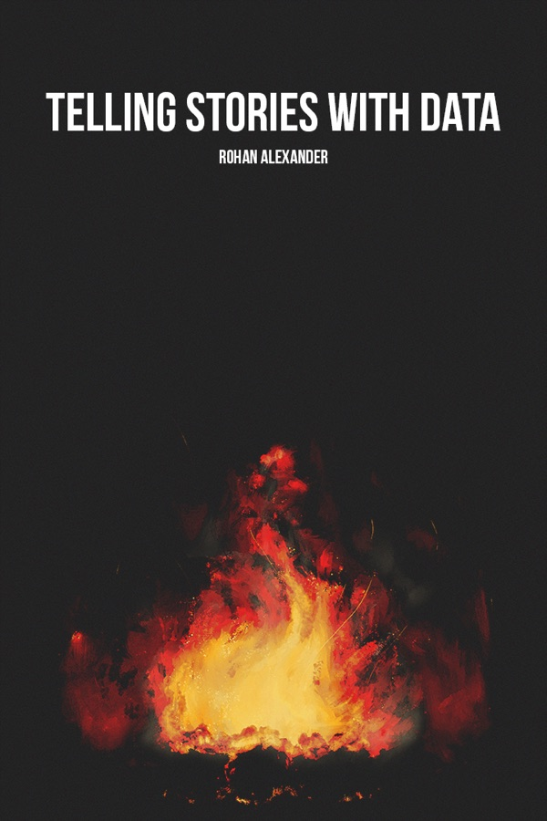
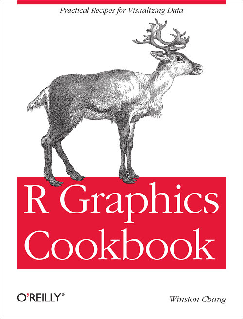

```{=html}
<div class="resource-page readings-page">
  <section class="resource-hero" aria-labelledby="books-title">
    <div>
      <p class="eyebrow">Course References</p>
      <h1 id="books-title">Books and Readings</h1>
      <p>The course readings point to open and durable resources. Books are separated from websites, guides, articles and function references.</p>
      <div class="resource-actions" aria-label="Quick access">
        <a class="home-action home-action--primary" href="#books">Books</a>
        <a class="home-action" href="#other-readings">Other readings and aids</a>
        <a class="home-action" href="#module-readings">Module readings</a>
      </div>
    </div>
    <div class="featured-covers" aria-label="Covers of the main books">
      
      
      
    </div>
  </section>

  <section class="resource-section" id="books" aria-labelledby="main-books-title">
    <div class="resource-section__header">
      <h2 id="main-books-title">Books</h2>
      <p>These books can serve as core references for R, statistics, visualization, reproducibility and the course project.</p>
    </div>
    <div class="reading-grid">
      <article class="reading-card" id="r4ds">
        <div class="reading-cover-frame"></div>
        <div class="reading-card-body">
          <p class="reading-source">Wickham, Çetinkaya-Rundel and Grolemund</p>
          <h3>R for Data Science, 2nd edition</h3>
          <p>Main reference for the tidyverse, import, transformation, visualization, dates, joins and communication.</p>
          <div class="reading-actions"><a href="https://r4ds.hadley.nz/" target="_blank" rel="noopener">Open the book</a></div>
        </div>
      </article>
      <article class="reading-card" id="ims">
        <div class="reading-cover-frame"></div>
        <div class="reading-card-body">
          <p class="reading-source">Çetinkaya-Rundel and Hardin</p>
          <h3>Introduction to Modern Statistics</h3>
          <p>Complement for numerical exploration, inference, statistical intuition and applied interpretation.</p>
          <div class="reading-actions"><a href="https://openintrostat.github.io/ims/" target="_blank" rel="noopener">Open the book</a></div>
        </div>
      </article>
      <article class="reading-card" id="openintro">
        <div class="reading-cover-frame"></div>
        <div class="reading-card-body">
          <p class="reading-source">Diez, Cetinkaya-Rundel and Barr</p>
          <h3>OpenIntro Statistics</h3>
          <p>Open reference for reviewing statistical foundations and uncertainty reasoning.</p>
          <div class="reading-actions"><a href="https://www.openintro.org/book/os/" target="_blank" rel="noopener">Open the resource</a></div>
        </div>
      </article>
      <article class="reading-card" id="tidytext">
        <div class="reading-cover-frame"></div>
        <div class="reading-card-body">
          <p class="reading-source">Silge and Robinson</p>
          <h3>Text Mining with R</h3>
          <p>Module 10 reference for turning text into tidy data, counting words and building lexical analyses.</p>
          <div class="reading-actions"><a href="https://www.tidytextmining.com/" target="_blank" rel="noopener">Open the book</a></div>
        </div>
      </article>
      <article class="reading-card" id="happy-git">
        <div class="reading-cover-frame reading-cover-frame--contain"></div>
        <div class="reading-card-body">
          <p class="reading-source">Bryan, STAT 545 TAs and Hester</p>
          <h3>Happy Git and GitHub for the useR</h3>
          <p>Practical guide for connecting RStudio, Git and GitHub, understanding commits, pushing work and collaborating in a repository.</p>
          <div class="reading-actions"><a href="https://happygitwithr.com/" target="_blank" rel="noopener">Open the book</a></div>
        </div>
      </article>
      <article class="reading-card" id="telling-stories-data">
        <div class="reading-cover-frame"></div>
        <div class="reading-card-body">
          <p class="reading-source">Alexander</p>
          <h3>Telling Stories with Data</h3>
          <p>Reference for building a complete analysis: question, data, preparation, modeling, communication and reproducible work.</p>
          <div class="reading-actions"><a href="https://rohanalexander.github.io/telling_stories-published/" target="_blank" rel="noopener">Open the book</a></div>
        </div>
      </article>
      <article class="reading-card" id="moderndive">
        <div class="reading-cover-frame"></div>
        <div class="reading-card-body">
          <p class="reading-source">Ismay, Kim and Valdivia</p>
          <h3>Statistical Inference via Data Science</h3>
          <p>Complement for connecting visualization, transformation, regression and statistical reasoning with tidyverse tools.</p>
          <div class="reading-actions"><a href="https://moderndive.com/v2/" target="_blank" rel="noopener">Open the book</a></div>
        </div>
      </article>
      <article class="reading-card" id="r-graphics-cookbook">
        <div class="reading-cover-frame"></div>
        <div class="reading-card-body">
          <p class="reading-source">Chang</p>
          <h3>R Graphics Cookbook, 2nd edition</h3>
          <p>Concrete recipes for improving ggplot2 graphs without rereading the full theory at every roadblock.</p>
          <div class="reading-actions"><a href="https://r-graphics.org/" target="_blank" rel="noopener">Open the book</a></div>
        </div>
      </article>
      <article class="reading-card" id="wilke-dataviz">
        <div class="reading-cover-frame"></div>
        <div class="reading-card-body">
          <p class="reading-source">Wilke</p>
          <h3>Fundamentals of Data Visualization</h3>
          <p>Open reference for choosing suitable charts and identifying fragile visual choices.</p>
          <div class="reading-actions"><a href="https://clauswilke.com/dataviz/" target="_blank" rel="noopener">Open the book</a></div>
        </div>
      </article>
    </div>
  </section>

  <section class="resource-section" id="other-readings" aria-labelledby="complements-title">
    <div class="resource-section__header">
      <h2 id="complements-title">Other readings and aids</h2>
      <p>This section groups websites, articles, guides, documentation and function references that support specific tasks.</p>
    </div>
    <div class="reading-grid">
      <article class="reading-card" id="dataorg-spreadsheets">
        <div class="reading-cover-frame reading-cover-placeholder reading-cover-placeholder--guide" aria-hidden="true"><span>Data<br>Org</span></div>
        <div class="reading-card-body">
          <p class="reading-source">Broman and Woo</p>
          <h3>Data Organization in Spreadsheets</h3>
          <p>Reference article for structuring a spreadsheet before import, keeping raw data intact and documenting corrections.</p>
          <div class="reading-actions"><a href="https://www.tandfonline.com/doi/full/10.1080/00031305.2017.1375989" target="_blank" rel="noopener">Open the article</a></div>
        </div>
      </article>
      <article class="reading-card" id="tidytext-unnest-tokens">
        <div class="reading-cover-frame reading-cover-placeholder reading-cover-placeholder--guide" aria-hidden="true"><span>tidytext<br>tokens</span></div>
        <div class="reading-card-body">
          <p class="reading-source">tidytext</p>
          <h3>unnest_tokens() Documentation</h3>
          <p>Documentation for the function that transforms a text column into tokens in a tidy table.</p>
          <div class="reading-actions"><a href="https://juliasilge.github.io/tidytext/reference/unnest_tokens.html" target="_blank" rel="noopener">Open documentation</a></div>
        </div>
      </article>
      <article class="reading-card" id="tidytext-bind-tfidf">
        <div class="reading-cover-frame reading-cover-placeholder reading-cover-placeholder--guide" aria-hidden="true"><span>tidytext<br>TF-IDF</span></div>
        <div class="reading-card-body">
          <p class="reading-source">tidytext</p>
          <h3>bind_tf_idf() Documentation</h3>
          <p>Documentation for the function that calculates and adds TF, IDF and TF-IDF to a count table.</p>
          <div class="reading-actions"><a href="https://juliasilge.github.io/tidytext/reference/bind_tf_idf.html" target="_blank" rel="noopener">Open documentation</a></div>
        </div>
      </article>
      <article class="reading-card" id="flexdashboard-docs">
        <div class="reading-cover-frame reading-cover-placeholder reading-cover-placeholder--guide" aria-hidden="true"><span>flex<br>dashboard</span></div>
        <div class="reading-card-body">
          <p class="reading-source">Posit</p>
          <h3>flexdashboard Documentation</h3>
          <p>Documentation for organizing several R visualizations and outputs into a dashboard page.</p>
          <div class="reading-actions"><a href="https://rmarkdown.rstudio.com/flexdashboard/" target="_blank" rel="noopener">Open documentation</a></div>
        </div>
      </article>
      <article class="reading-card" id="flexdashboard-shiny">
        <div class="reading-cover-frame reading-cover-placeholder reading-cover-placeholder--guide" aria-hidden="true"><span>Shiny<br>Dash</span></div>
        <div class="reading-card-body">
          <p class="reading-source">Posit</p>
          <h3>Using Shiny with flexdashboard</h3>
          <p>Short guide for adding interactive inputs and reactive outputs to a flexdashboard dashboard.</p>
          <div class="reading-actions"><a href="https://rstudio.github.io/flexdashboard/articles/shiny.html" target="_blank" rel="noopener">Open the guide</a></div>
        </div>
      </article>
      <article class="reading-card" id="shiny-basics">
        <div class="reading-cover-frame reading-cover-placeholder reading-cover-placeholder--guide" aria-hidden="true"><span>Shiny<br>Basics</span></div>
        <div class="reading-card-body">
          <p class="reading-source">Posit</p>
          <h3>Shiny Basics</h3>
          <p>Introduction to the structure of an interactive application and the role of reactive inputs and outputs.</p>
          <div class="reading-actions"><a href="https://shiny.posit.co/r/getstarted/shiny-basics/lesson1/" target="_blank" rel="noopener">Open resource</a></div>
        </div>
      </article>
      <article class="reading-card" id="tidy-style">
        <div class="reading-cover-frame reading-cover-placeholder reading-cover-placeholder--guide" aria-hidden="true"><span>Tidyverse<br>Style</span></div>
        <div class="reading-card-body">
          <p class="reading-source">Tidyverse</p>
          <h3>The Tidyverse Style Guide</h3>
          <p>Guide for writing readable, coherent R code that is easier to review.</p>
          <div class="reading-actions"><a href="https://style.tidyverse.org/" target="_blank" rel="noopener">Open the guide</a></div>
        </div>
      </article>
      <article class="reading-card" id="quarto-docs">
        <div class="reading-cover-frame reading-cover-placeholder reading-cover-placeholder--quarto" aria-hidden="true"><span>Quarto<br>Docs</span></div>
        <div class="reading-card-body">
          <p class="reading-source">Posit</p>
          <h3>Quarto Documentation</h3>
          <p>Official documentation for creating, rendering and publishing Quarto documents, reports and websites.</p>
          <div class="reading-actions"><a href="https://quarto.org/docs/" target="_blank" rel="noopener">Open the documentation</a></div>
        </div>
      </article>
      <article class="reading-card" id="github-docs">
        <div class="reading-cover-frame reading-cover-placeholder reading-cover-placeholder--github" aria-hidden="true"><span>GitHub<br>Docs</span></div>
        <div class="reading-card-body">
          <p class="reading-source">GitHub</p>
          <h3>GitHub Docs</h3>
          <p>Official documentation for repositories, commits, branches, issues and GitHub workflows.</p>
          <div class="reading-actions"><a href="https://docs.github.com/" target="_blank" rel="noopener">Open the documentation</a></div>
        </div>
      </article>
      <article class="reading-card" id="rvest-docs">
        <div class="reading-cover-frame reading-cover-placeholder reading-cover-placeholder--guide" aria-hidden="true"><span>rvest<br>Docs</span></div>
        <div class="reading-card-body">
          <p class="reading-source">Tidyverse</p>
          <h3>rvest Documentation</h3>
          <p>Official documentation for reading an HTML page, selecting elements, extracting text and converting tables.</p>
          <div class="reading-actions"><a href="https://rvest.tidyverse.org/" target="_blank" rel="noopener">Open the documentation</a></div>
        </div>
      </article>
      <article class="reading-card" id="mdn-robots">
        <div class="reading-cover-frame reading-cover-placeholder reading-cover-placeholder--guide" aria-hidden="true"><span>MDN<br>robots</span></div>
        <div class="reading-card-body">
          <p class="reading-source">MDN Web Docs</p>
          <h3>robots.txt</h3>
          <p>Technical reference for understanding the role of a robots.txt file in the instructions given to crawlers.</p>
          <div class="reading-actions"><a href="https://developer.mozilla.org/en-US/docs/Glossary/Robots.txt" target="_blank" rel="noopener">Open the resource</a></div>
        </div>
      </article>
      <article class="reading-card" id="google-robots">
        <div class="reading-cover-frame reading-cover-placeholder reading-cover-placeholder--guide" aria-hidden="true"><span>Google<br>robots</span></div>
        <div class="reading-card-body">
          <p class="reading-source">Google Search Central</p>
          <h3>Introduction to robots.txt</h3>
          <p>Complementary guide for situating what robots.txt can and cannot control in web crawling.</p>
          <div class="reading-actions"><a href="https://developers.google.com/search/docs/crawling-indexing/robots/intro" target="_blank" rel="noopener">Open the resource</a></div>
        </div>
      </article>
      <article class="reading-card" id="robotstxt-docs">
        <div class="reading-cover-frame reading-cover-placeholder reading-cover-placeholder--guide" aria-hidden="true"><span>robotstxt<br>R</span></div>
        <div class="reading-card-body">
          <p class="reading-source">rOpenSci</p>
          <h3>robotstxt Documentation</h3>
          <p>Documentation for the R package used to check whether a path is allowed by a site's robots.txt rules.</p>
          <div class="reading-actions"><a href="https://docs.ropensci.org/robotstxt/" target="_blank" rel="noopener">Open the documentation</a></div>
        </div>
      </article>
      <article class="reading-card" id="r-lm-docs">
        <div class="reading-cover-frame reading-cover-placeholder reading-cover-placeholder--guide" aria-hidden="true"><span>R<br>lm</span></div>
        <div class="reading-card-body">
          <p class="reading-source">R Core Team</p>
          <h3>lm() Documentation</h3>
          <p>Documentation for the R function that fits linear models and supports the prediction work in module 9.</p>
          <div class="reading-actions"><a href="https://stat.ethz.ch/R-manual/R-devel/library/stats/html/lm.html" target="_blank" rel="noopener">Open the documentation</a></div>
        </div>
      </article>
      <article class="reading-card" id="r-predict-lm-docs">
        <div class="reading-cover-frame reading-cover-placeholder reading-cover-placeholder--guide" aria-hidden="true"><span>R<br>predict</span></div>
        <div class="reading-card-body">
          <p class="reading-source">R Core Team</p>
          <h3>predict.lm() Documentation</h3>
          <p>Documentation for the R method that produces predictions from a fitted linear model.</p>
          <div class="reading-actions"><a href="https://stat.ethz.ch/R-manual/R-devel/library/stats/html/predict.lm.html" target="_blank" rel="noopener">Open the documentation</a></div>
        </div>
      </article>
      <article class="reading-card" id="canada-adm-guide">
        <div class="reading-cover-frame reading-cover-placeholder reading-cover-placeholder--guide" aria-hidden="true"><span>Canada<br>ADM</span></div>
        <div class="reading-card-body">
          <p class="reading-source">Government of Canada</p>
          <h3>Guide on Automated Decision-Making</h3>
          <p>Institutional reference for discussing transparency, accountability and limits of automated decision systems.</p>
          <div class="reading-actions"><a href="https://www.canada.ca/en/government/system/digital-government/digital-government-innovations/responsible-use-ai/guide-scope-directive-automated-decision-making.html" target="_blank" rel="noopener">Open the guide</a></div>
        </div>
      </article>
      <article class="reading-card" id="nist-bias-ai">
        <div class="reading-cover-frame reading-cover-placeholder reading-cover-placeholder--guide" aria-hidden="true"><span>NIST<br>Bias</span></div>
        <div class="reading-card-body">
          <p class="reading-source">Schwartz et al.</p>
          <h3>NIST SP 1270</h3>
          <p>Reference for identifying and managing possible biases in artificial intelligence systems.</p>
          <div class="reading-actions"><a href="https://www.nist.gov/publications/towards-standard-identifying-and-managing-bias-artificial-intelligence" target="_blank" rel="noopener">Open the resource</a></div>
        </div>
      </article>
      <article class="reading-card" id="rss-dataviz">
        <div class="reading-cover-frame reading-cover-placeholder reading-cover-placeholder--guide" aria-hidden="true"><span>RSS<br>Guide</span></div>
        <div class="reading-card-body">
          <p class="reading-source">Royal Statistical Society</p>
          <h3>Best Practices for Data Visualisation</h3>
          <p>Practical guide for making charts readable, honest and aligned with the statistical message.</p>
          <div class="reading-actions"><a href="https://royal-statistical-society.github.io/datavisguide/RSS-data-vis-guide.pdf" target="_blank" rel="noopener">Open the guide</a></div>
        </div>
      </article>
      <article class="reading-card" id="graphics-principles-cheat-sheet">
        <div class="reading-cover-frame reading-cover-placeholder reading-cover-placeholder--guide" aria-hidden="true"><span>Graph<br>Design</span></div>
        <div class="reading-card-body">
          <p class="reading-source">PDF resource</p>
          <h3>Graphics Principles Cheat Sheet</h3>
          <p>Cheat sheet for reviewing graphic design principles and improving the readability of visualizations.</p>
          <div class="reading-actions"><a href="../assets/lectures/module_07/graphics-principles-cheat-sheet.pdf" target="_blank" rel="noopener">Open the PDF</a></div>
        </div>
      </article>
      <article class="reading-card" id="conception-graphique">
        <div class="reading-cover-frame reading-cover-placeholder reading-cover-placeholder--guide" aria-hidden="true"><span>Graphic<br>Design</span></div>
        <div class="reading-card-body">
          <p class="reading-source">PDF resource</p>
          <h3>Conception graphique</h3>
          <p>Slide deck on graphic design principles useful for producing clearer and more defensible figures.</p>
          <div class="reading-actions"><a href="../assets/lectures/module_07/conception-graphique.pdf" target="_blank" rel="noopener">Open the PDF</a></div>
        </div>
      </article>
      <article class="reading-card" id="quebec-anonymisation">
        <div class="reading-cover-frame reading-cover-placeholder reading-cover-placeholder--guide" aria-hidden="true"><span>QC<br>Data</span></div>
        <div class="reading-card-body">
          <p class="reading-source">Gouvernement du Québec</p>
          <h3>Anonymisation</h3>
          <p>Institutional guidance for discussing personal information, protection and data publication.</p>
          <div class="reading-actions"><a href="https://www.quebec.ca/gouvernement/travailler-gouvernement/normes-gouvernance-pratiques-internes/protection-des-renseignements-personnels/anonymisation" target="_blank" rel="noopener">Open the resource</a></div>
        </div>
      </article>
      <article class="reading-card" id="cnil-anonymisation">
        <div class="reading-cover-frame reading-cover-placeholder reading-cover-placeholder--guide" aria-hidden="true"><span>CNIL<br>Guide</span></div>
        <div class="reading-card-body">
          <p class="reading-source">CNIL</p>
          <h3>Anonymisation of Personal Data</h3>
          <p>Useful reference for distinguishing anonymization, pseudonymization and residual risks.</p>
          <div class="reading-actions"><a href="https://www.cnil.fr/fr/technologies/lanonymisation-de-donnees-personnelles" target="_blank" rel="noopener">Open the resource</a></div>
        </div>
      </article>
      <article class="reading-card" id="guide-loi-25">
        <div class="reading-cover-frame reading-cover-placeholder reading-cover-placeholder--guide" aria-hidden="true"><span>Loi 25<br>Video</span></div>
        <div class="reading-card-body">
          <p class="reading-source">Video resource</p>
          <h3>Guide de la Loi 25</h3>
          <p>Short video for situating obligations related to personal information protection in Quebec.</p>
          <div class="reading-actions"><a href="../assets/lectures/module_07/guide-loi-25.mp4" target="_blank" rel="noopener">Open the video</a></div>
        </div>
      </article>
      <article class="reading-card" id="techniques-anonymisation-donnees">
        <div class="reading-cover-frame reading-cover-placeholder reading-cover-placeholder--guide" aria-hidden="true"><span>Anonymization<br>HTML</span></div>
        <div class="reading-card-body">
          <p class="reading-source">HTML resource</p>
          <h3>Techniques de base en anonymisation de données</h3>
          <p>Working page on direct identifier removal, pseudonymization, quasi-identifiers and reducing re-identification risk.</p>
          <div class="reading-actions"><a href="../assets/lectures/module_07/techniques-anonymisation-donnees.html" target="_blank" rel="noopener">Open the page</a></div>
        </div>
      </article>
      <article class="reading-card" id="aide-memoire-ethique">
        <div class="reading-cover-frame reading-cover-placeholder reading-cover-placeholder--guide" aria-hidden="true"><span>Ethics<br>PDF</span></div>
        <div class="reading-card-body">
          <p class="reading-source">Course document</p>
          <h3>Pratique responsable en statistique et science des données</h3>
          <p>Concise checklist for reviewing ethical issues in study design, data collection, analysis, dissemination and use of results.</p>
          <div class="reading-actions"><a href="../assets/lectures/module_07/aide-memoire-ethique.pdf" target="_blank" rel="noopener">Open the PDF</a></div>
        </div>
      </article>
      <article class="reading-card" id="fair-principles">
        <div class="reading-cover-frame reading-cover-placeholder reading-cover-placeholder--guide" aria-hidden="true"><span>FAIR<br>Data</span></div>
        <div class="reading-card-body">
          <p class="reading-source">Wilkinson et al.</p>
          <h3>FAIR Guiding Principles</h3>
          <p>Reference article on the Findable, Accessible, Interoperable and Reusable principles.</p>
          <div class="reading-actions"><a href="https://www.nature.com/articles/sdata201618" target="_blank" rel="noopener">Open the article</a></div>
        </div>
      </article>
    </div>
  </section>

  <section class="resource-section" id="module-readings" aria-labelledby="readings-title">
    <div class="resource-section__header">
      <h2 id="readings-title">Module and Project Readings</h2>
      <p>This summary helps you quickly find the references called by the learning plans and the resources useful for the course project.</p>
    </div>
    <div class="reading-map">
      <article><h3>Module 01</h3><p><a href="#r4ds">R for Data Science</a> for the workflow and <a href="#quarto-docs">Quarto</a> for the HTML report.</p></article>
      <article><h3>Module 02</h3><p><a href="#r4ds">R for Data Science</a> for visualization, transformation, exploration and spreadsheets; <a href="#dataorg-spreadsheets">Broman and Woo</a> for organizing Excel files before analysis.</p></article>
      <article><h3>Module 03</h3><p>R for Data Science: strings, factors, recoding and guidance for categorical variables.</p></article>
      <article><h3>Module 04</h3><p><a href="#r4ds">R for Data Science</a> for import, tidy data, missing values, factors, spreadsheets, JSON and nested data; <a href="#dataorg-spreadsheets">Broman and Woo</a> for tabular files.</p></article>
      <article><h3>Module 05</h3><p><a href="#r4ds">R for Data Science</a> for EDA, dates, visualization and missing values; <a href="#ims">Introduction to Modern Statistics</a> for numerical exploration; <a href="#r-graphics-cookbook">R Graphics Cookbook</a> for refining a graph.</p></article>
      <article><h3>Module 06</h3><p><a href="#github-docs">GitHub Docs</a> and <a href="#happy-git">Happy Git</a> for repositories, issues, pull requests and conflicts; Quarto for inline code and execution options; R for Data Science for joins.</p></article>
      <article><h3>Module 07</h3><p><a href="#r4ds">R for Data Science</a> for communication, <a href="#wilke-dataviz">Wilke</a>, the <a href="#rss-dataviz">RSS guide</a>, <a href="#graphics-principles-cheat-sheet">Graphics Principles Cheat Sheet</a>, <a href="#conception-graphique">Conception graphique</a> and <a href="#r-graphics-cookbook">R Graphics Cookbook</a> for responsible visualization, then <a href="#quebec-anonymisation">Québec</a>, <a href="#cnil-anonymisation">CNIL</a>, <a href="#guide-loi-25">Guide de la Loi 25</a>, <a href="#techniques-anonymisation-donnees">Techniques de base en anonymisation de données</a>, the <a href="#aide-memoire-ethique">ethics checklist</a> and <a href="#fair-principles">FAIR</a> for anonymization, confidentiality and data reuse.</p></article>
      <article><h3>Module 08</h3><p><a href="#r4ds">R for Data Science</a> for HTML, functions and iteration, <a href="#rvest-docs">rvest</a> for extraction, then <a href="#mdn-robots">MDN</a>, <a href="#google-robots">Google Search Central</a> and <a href="#robotstxt-docs">robotstxt</a> for collection limits.</p></article>
      <article><h3>Module 09</h3><p><a href="#ims">Introduction to Modern Statistics</a> and <a href="#moderndive">ModernDive</a> for simple and multiple regression, <a href="#r-lm-docs">lm()</a> and <a href="#r-predict-lm-docs">predict.lm()</a> for the R implementation, then the <a href="#canada-adm-guide">Government of Canada guide</a> and <a href="#nist-bias-ai">NIST SP 1270</a> for discussing bias and automated decisions.</p></article>
      <article><h3>Module 10</h3><p><a href="#tidytext">Text Mining with R</a> for tidy text format, sentiment and TF-IDF, <a href="#tidytext-unnest-tokens">unnest_tokens()</a> and <a href="#tidytext-bind-tfidf">bind_tf_idf()</a> for key functions, then <a href="#flexdashboard-docs">flexdashboard</a>, <a href="#flexdashboard-shiny">Shiny with flexdashboard</a> and <a href="#shiny-basics">Shiny Basics</a> for the interactive dashboard.</p></article>
      <article><h3>Course project</h3><p><a href="#telling-stories-data">Telling Stories with Data</a> for the full workflow, <a href="#happy-git">Happy Git</a> for the repository, <a href="#dataorg-spreadsheets">Broman and Woo</a> for tabular data and <a href="#quarto-docs">Quarto</a> for reproducible communication.</p></article>
    </div>
  </section>

  <section class="resource-section" aria-labelledby="sources-title">
    <div class="resource-section__header">
      <h2 id="sources-title">Visual Sources</h2>
      <p>The covers displayed here help students quickly recognize the main course resources.</p>
    </div>
  </section>
</div>
```
