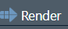

# How to pass this module {.unnumbered}

Welcome to this first data science adventure! This module is designed to provide you with a comprehensive introduction to the fundamental tools and concepts that will support you throughout your data science journey.

- **Read each section carefully** before proceeding with the experiment. Theoretical explanations provide the basis for understanding the practical examples.

- **Actively experiment** by running the proposed code and exploring the results. Feel free to modify the examples to test your ideas.

- **Ask questions** if you encounter difficulties or if certain concepts remain unclear.

This module is a gateway to the vast world of data science. Take the time to explore each step, and have fun learning!

# IT tools

In this course, we will use professional computing tools that are essential in data science. These tools allow data to be manipulated, analyzed and visualized in an efficient and reproducible manner. Here is an overview of the main tools that you will discover:

**RStudio**: An Integrated Development Environment (IDE) for R that makes it easy to write scripts, run code, and manage projects. It offers an intuitive interface and many professional features to help you structure your analyses.

**Quarto**: a powerful tool for producing reproducible documents that combine explanatory text, code and results. With Quarto, you can generate professional reports, presentations and even websites.

These tools are not limited to their technical aspect; they also promote good practices in data science, such as rigorous project organization, clear documentation and reproducibility of analyses. They will be your allies throughout this course and your future experiences in data science.

## Discovery of RStudio

RStudio is an integrated development environment (IDE) for R. It makes it easy to write, run, and manage projects in R, while integrating many professional features. Here is an overview of its main windows and functionalities:

### The main windows of RStudio

RStudio is made up of four main panels:

- **Console**: generally located at the bottom left, it allows you to directly execute commands in R.

- **Script**: at the top left, this is the place where you write and save your scripts (`.R` or `.qmd` files). You can notice that this adventure is indeed a `.qmd` in the script window.

- **Environment**: at the top right, it displays the objects currently available in memory (*datasets*, variables, functions).

- **Graph (*Plots*), files and help**: at the bottom right, this panel allows you to view your graphs, explore the project files, or access the documentation.

::: callout-note
#### Example

- **Test the console**: open the console and type the following command:

    ``` r
    print("Hello, RStudio!")
    ```

    Observe the result displayed directly in the console.

- **Create a script**: Click `File > New File > R Script`, write the following code and run it with `Ctrl + Enter` (Windows/Linux) or `Cmd + Enter` (Mac):

    ``` r
    message("You are working in an R script!")
    ```

    Save the file under the name `test_script.R`.
:::

### Important features

- **Projects**: RStudio organizes your work into projects, which is ideal for structuring your files and data. We will work on projects from the next module.

- **Integrated Terminal**: to execute system commands without leaving RStudio. We won't use it for the moment but know that it exists.

- **Packages**: the "Packages" tab allows you to easily install and load libraries.

::: callout-tip
#### Exercise

Install the `dplyr` package using the GUI or via the following command in the console:

```{r, eval=FALSE}
install.packages("dplyr")
```

Once installed, load it with:

```{r, eval=FALSE}
library(dplyr)
```
:::

### Configure your environment

To get started efficiently, customize the preferences (`Tools > Global Options`) to adjust the appearance and settings according to your needs.

::: callout-tip
#### Exercise

- **Exploring options**: Access `Tools > Global Options` and explore the different possible configurations. Try changing the interface theme (e.g. dark theme) and see the difference.
:::

## Basics of programming in R

R programming is essential for manipulating, analyzing and visualizing data. This section introduces you to the basics of programming and offers you exercises to practice.

### Create and manipulate objects

In R, everything is an object. Here are the basics for creating objects and manipulating them:

::: callout-tip
#### Exercise

- **Create an object**:

    ``` r
    x <- 42 # Assigns the value 42 to the object x
    print(x) # Print the value of x
    x # Also displays the value of x
    ```

- **Manipulate a vector**:

    ``` r
    vector <- c(1, 2, 3, 4, 5) # Creates a vector
    sum <- sum(vector) # Calculates the sum of the elements
    sum
    ```

- Create a vector containing the numbers 1 to 10 and calculate its average using the `sum()` function.
:::

### Write conditions

Conditions allow you to make your scripts dynamic.

::: callout-note
#### Example

- **Simple condition**:

    ``` r
    number <- 10
    if (number > 5) {
      print("The number is greater than 5")
    } else {
      print("The number is less than or equal to 5")
    }
    ```
:::

::: callout-tip
#### Exercise

- Write a condition that displays whether a number is even or odd.

Hint: the `%%` function in R gives the remainder of the Euclidean division. For example `10%%2` is 0 because $10=5\times2$.
:::

### Built-in basic functions

R has many built-in functions to perform simple or advanced calculations. For example, there is the `mean` function which, as its name suggests, allows you to calculate an average.

The following code block allows us to calculate the average of the vector `(1, 3, 5, 7)`.

```{r}
x <- c(1, 3, 5, 7) # Defines the vector x
mean(x) # Call the mean function on x
```

When you want help with a function, you can simply type the name of it in the help tab in the bottom right dial.

### Define a new function

R also allows us to define our own functions. We will do this several times in the course. Here is a simple little example.

::: callout-note
#### Example

- **Basic calculation**:

    ``` r
    square <- function(x) {
      return(x^2)
    }
    print(square(4))
    ```
:::

::: callout-tip
#### Exercise

- Create a `cube` function that calculates the cube of a number, then test it with the values 2, 3 and 4.
:::

### Good programming practices

Here are some tips for writing clean, maintainable code:

#### Golden rules

1. **Name your objects descriptively**:

    ``` r
    average_notes <- mean(c(80, 85, 90))
    ```

2. **Organize your script with comments**:

    ``` r
    # Calculation of the sum
    sum <- sum(vector)
    ```

In the course, you must follow the [tydiverse coding best practices](https://style.tidyverse.org/). For this module, we will pay particular attention to certain parts of this guide: chapter 1 Files, chapter 2 Syntax and section 3.1 Functions/Naming. The table below summarizes the important criteria of these sections and will serve as an evaluation grid for your codes. Note that this grid will evolve over the modules.

```{r, echo=FALSE}
library(knitr)
kable(
  data.frame(
    Criterion = c("Syntax and indentation", "Spaces and readability", "Line length", "Assignment", "Object naming", "Function style", "Consistency and clarity", "Useful comments"),
    Explanation = c(
      "Respect for indentation and code structure (2 spaces per nesting level, no tabulation)",
      "Consistent spaces around operators (`<-`, `=`, `+`, etc.) and after commas to improve readability.",
      "Lines of code do not exceed 80 characters (except for justified exceptions)",
      "Using `<-` instead of `=` for assigning values.",
      "Use of explicit names and in `snake_case` Ex: `ma_variable` rather than `MaVariable` or `maVariable`.",
      "Spaces after commas, no spaces before opening parentheses. Ex: `mean(x, na.rm = TRUE)`.",
      "The code is written in a clear and understandable manner, avoiding unnecessary complexity.",
      "Comments are concise and helpful, without being redundant. Use of `#` with a space after it."    )
  ),
  caption = "R code evaluation grid according to tidyverse style."
)
```

::: callout-tip
#### Exercise

- Identify style errors in code.

- Correct them by applying tidyverse style best practices.

    ``` r
    MyFunction = function(x,y){
    result=x+y
    return(result) }

    df=data.frame(id=1:5,name=c("Alice","Bob","Charlie","David","Eva"))
    df_filtered = subset(df, id>2)
    df_selected = df_filtered[,c("name")]
    df_selected$Upper = toupper(df_selected$name)
    mean(c(1,2,3,4,5),na.rm=TRUE)
    ```
:::

```{r eval=FALSE, echo= FALSE}
# Define a function with an explicit name and well formatted
my_function <- function(x, y) {
  result <- x + y
  return(result)
}

# Create a data frame with tibble (optional, otherwise data.frame remains valid here)
df <- data.frame(
  id = 1:5,
  name = c("Alice", "Bob", "Charlie", "David", "Eva")
)

# Filter rows with id > 2
df_filtered <- df[df$id > 2, ]

# Select the "name" column
df_selected <- df_filtered[, c("name")]

# Add a column with names in uppercase
df_selected$upper <- toupper(df_selected$name)

# Calculate the average
mean(c(1, 2, 3, 4, 5), na.rm = TRUE)
```

## Introduction to Quarto

Quarto is a powerful tool for creating reproducible documents combining text, code, and results. It supports different formats, such as HTML, PDF and Word.

### What is Quarto?

Quarto lets you combine R, Python or Julia code with textual explanations, while generating professional reports. Of course, in this course we will use it with R. Its main advantages include:

- **Reproducibility**: the code and the results are directly integrated into the same document.

- **Versatility**: possibility of generating various types of files (reports, presentations, websites).

- **Ease of use**.

### Structure of a Quarto document

A Quarto file always starts with a YAML header, followed by Markdown content and chunks of code.

#### Basic Quarto file example

``` yaml
---
title: "My first Quarto document"
format: html
editor: visual
---
```

#### Insert a *chunk* (block of code) R

To insert a *chunk* (block of code) into a quarto document, you can click on the following symbol:


```{r}
# This is a block of code
2+2
```

You can easily execute a block of code either by executing (`Ctrl + Enter`) line by line or by clicking on the small green arrow in the upper left corner of the code block. You will notice that your results appear below the code box.

Once your report is final, you can generate the report by clicking on the Render button: 

::: callout-note
#### Example

- **Create a Quarto document**:
    1. Click `File > New File > Quarto Document`.
    2. Choose the desired format (HTML, PDF, Word) and generate a basic document.
    3. Insert a code block with `Ctrl + Alt + I` shortcut (or symbol) and add R code (a simple trick).
- **Generate the document**: Use `Ctrl + Shift + K` (or the render button) to generate the final report.
:::

::: callout-tip
#### Exercise

1. Create a Quarto document in HTML format.
2. Add an R code block to display a summary of the `mtcars` dataset (this is `summary(mtcars)`).
3. Customize the YAML header to include your name and a date.
:::

# Library and data

We saw above that you can improve your R experience by using libraries. As part of the course, we will use a library called `UlavalSSD`. This is a library developed for the course.

## `UlavalSSD`

First, you will install the `UlavalSSD` library and load it into your working environment.

```{r eval=FALSE}
# Install the remotes package if necessary
install.packages("remotes")

# Install UlavalSSD from GitHub
remotes::install_github("AurelienNicosiaULaval/UlavalSSD")
```

```{r}
library(UlavalSSD)
```

Loading the library will allow us to access all of its contents. You can see the library help files with the following code (or by searching in the package tab on the right)

```{r eval=FALSE}
help(package = "UlavalSSD")
```

::: callout-tip
#### Exercise

- Search the contents of the bookstore. What do you notice?
:::

## `MeteoQuebec` data

In this adventure, we will work with the dataset called `MeteoQuebec` available in the `UlavalSSD` library. It is important to note that if the library is not loaded (`library(UlavalSSD)`) then you will not be able to access this dataset.

::: callout-tip
#### Exercise

- `MeteoQuebec` is an object name in the environment. Display the database by creating a code block.
- How many rows and columns does this dataset have?
- Explore the help to make sure you understand what each column represents.
:::

# Clean data (`Tidy` in English)

## What is clean data?

In the context of data science, **clean data** refers to a set of data that is ready to be used for analyses. This means that the data is organized, consistent, and free of errors or inconsistencies. Working with clean data is essential to ensure the quality of analysis results and models.

### Characteristics of clean data

Clean data must meet the following criteria:

- **No missing values**: All data necessary for the analysis is present.
- **Uniformity of formats**: The formats of dates, numbers and character strings are consistent.
- **No duplicates**: Duplicate entries have been identified and removed if necessary.
- **Error Removal**: Inconsistent or incorrect data has been corrected.
- **Well-defined columns**: Each column has a clear and unique meaning.
- **One line per observation**: The data is structured in a tabular manner, with one line representing a single observation.

### Example of non-clean data

A table containing the following data:

| Name | Date of Birth | Score |
|--------|----------------|-------|
| Alice | 01/01/1990 | 85.5 |
| Bob | 1990-02-15 | 90 |
| Charlie |                | 87.5 |
| Alice | 01/01/1990 | 85.5 |

Problems: - The date format is not consistent. - A line contains a missing value (Birth Date for Charlie). - The data contains a duplicate for Alice.

### Example of clean data

After cleaning, the data becomes:

| Name | Date of Birth | Score |
|--------|----------------|-------|
| Alice | 1990-01-01 | 85.5 |
| Bob | 1990-02-15 | 90.0 |
| Charlie | 1992-03-20 | 87.5 |

- The date format is uniform (YYYY-MM-DD).
- Duplicates have been removed.
- Missing values ​​have been completed or deleted.

In the coming weeks we will have a complete module on data cleansing. This is simply to introduce you to the concept of clean data so that you are attentive to this aspect every time you encounter data.

::: callout-tip
#### Exercise

- In the `MeteoQuebec` dataset, check if there is any missing data. You can use the `summary` function for this. When we apply the `summary` function to a dataset, it gives us descriptive statistics (we will come back to this), but above all it gives the number of missing data per column.

- Are the `MeteoQuebec` data clean? Justify your answer.
:::

# Data manipulation

In this section, we will learn how to manipulate simple data tables in R. You will discover how to extract a row, a column and create a new column using the brackets `[]` and the operator `$`.

## Example of data table

We will use `MeteoQuebec` data. The `head` function is very practical, because as its name suggests, it displays the top (the head) of the database. This allows you to have quick access to the information contained in the variables.

```{r}
# Displaying the top of the dataset
head(MeteoQuebec)
```

### Extract a line with brackets `[]`

To extract a specific row, use the format `data_name[row_number, ]`.

Example: Let's get the 2nd line:

```{r}
# Extract the 2nd line
line_2 <- MeteoQuebec[2, ]
print(line_2)
```

### Extract a column with brackets `[]`

To extract a column, you can use `data_name[, column_number]` or `data_name[["column_name"]]`.

**Attention**, usually we prefer to extract a column by its name rather than by its number. First of all, if your dataset contains many columns, it will become tedious to find the right number. Also, to be reproducible, it is better to work with the name, since even if the order of the columns changes, your analysis will remain valid.

Example: Let's get the **total_precip** column:

```{r,eval=FALSE}
# Method 1: By column number
column_score <- MeteoQuebec[, 7]
print(score_column)

#Method 2: By column name
column_score2 <- MeteoQuebec[["total_precip"]]
print(column_score2)
```

### Extract a column with the `$` operator

A simpler method to extract a column is to use the `$` operator.

Example: Let's get the **mean_temp** column:

```{r,eval=FALSE}
# Extract the "mean_temp" column
column_mean_temp <- MeteoQuebec$mean_temp 
print(column_mean_temp)
```

::: callout-note
#### Example

- In the console, type the name of the database `MeteoQuebec`, add a `$` at the end. What is happening?
:::

### Add a new column with `$`

To create a new column, use the `$` operator and assign a value to it.

Example: Let's add a column **extended_temp**, equal to **max_temp-min_temp**:

```{r}
# Add a new column
MeteoQuebec$extended_temp <- MeteoQuebec$max_temp -MeteoQuebec$min_temp
head(MeteoQuebec)
```

::: callout-tip
#### Exercise

- Create a new column **mean_temp_F** which corresponds to the average temperature per day in degrees fahrenheit.
:::

### Filter rows based on logical conditions

You can use logical conditions with `[]` brackets to extract specific lines.

Example: Let's get the lines where the average temperature **mean_temp** is greater than 25:

```{r,eval=FALSE}
# Extract rows with a Score > 85
lines_mean_temp_25 <- MeteoQuebec[MeteoQuebec$mean_temp > 25, ]
print(lines_mean_temp_25)
```

::: callout-tip
#### Exercise

- Get the lines where the precipitation total **total_precip** is zero:
- Obtain the subset of data for the month of June only.
:::

**Combine multiple conditions with** `&` or `|`:

- **AND (`&`)**: All conditions must be true to include a line.
- **OR (`|`)**: At least one of the conditions must be true to include a line.

Here is an example where we will look for the subset of data corresponding to the days in the year 2000 for which there was no precipitation.

```{r,eval=TRUE}
head(MeteoQuebec[MeteoQuebec$year == 2000 & MeteoQuebec$total_precip == 0,])
```

### Summary

| Action | Order |
|----|----|
| Extract a row | `data[line_number, ]` |
| Extract a column (brackets) | `data[, column_number]` or `data[["column_name"]]` |
| Extract a column (`$`) | `data$column_name` |
| Add a new column | `data$new_column <- ...` |
