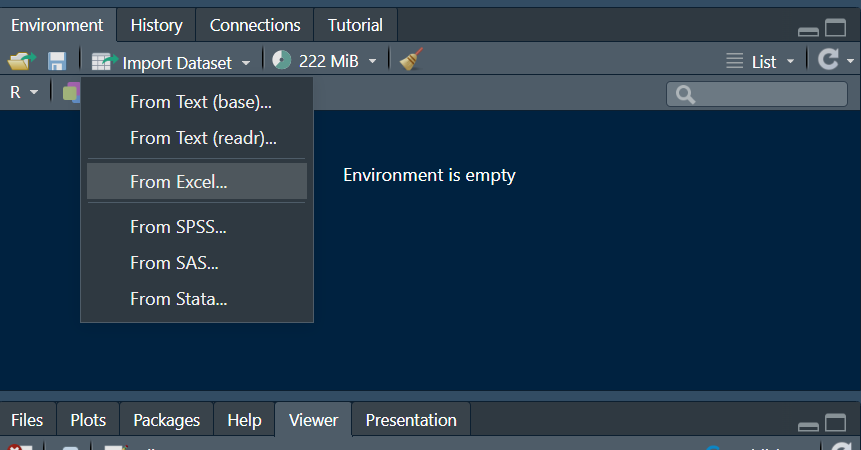

```{r setup, echo=FALSE, message=FALSE, warning=FALSE}
library(palmerpenguins)
library(tidyverse)

#Here are the changes I made to the penguin dataset for this adventure:
#penguins[c(11), c("body_mass_g", "bill_length_mm")]

#Adding an outlier on a single variable:
#One individual has a flipper_length_mm of 400 mm, which is well beyond normal.
#Added an outlier on two variables:
#An individual has a body mass (body_mass_g) of 9000 g and a bill length (bill_length_mm) of 20 mm, an inconsistent combination.

library(UlavalSSD)
```

## Antarctic Mission – In the shoes of a data scientist

Welcome to your new scientific mission! You are now a **data scientist** in the team of **Dr Adélie**, a researcher specializing in the study of Antarctic penguins. She has entrusted you with a set of data collected in the field to help her explore certain avenues of research.

Your job is to **manipulate, transform and visualize** data rigorously, in order to extract useful and reproducible information. In particular, you will need to produce convincing visualizations, calculate descriptive statistics and document your approach in a clear report.

>  The dataset, which contains physical measurements of several species of penguins, will serve as a field of investigation.

----------------------------------------------------------------------------------

## Progress of the mission and expected deliverables

The mission will take place in **two stages**, because Dr. Adélie will soon have to leave on an expedition to Antarctica.

### Part 1 – Before Dr. Adélie leaves

Before her departure, you will work closely with her to explore the first avenues. She will ask you to:

- Clean and transform data with `dplyr`.
- Calculate relevant descriptive statistics on numerical variables.
- Create exploratory visualizations (`ggplot2`) to better understand the relationships between variables.

 **Deliverable from the first part**:\
You must write a **logbook** in a Quarto report (HTML format) which documents your observations, your explorations and the avenues that you raised with her. This log is used to keep track of your analyzes before they go into the field. A logbook template will be given to you.

----------------------------------------------------------------------------------

### Part 2 – When Dr. Adélie returns

Back from her mission, Dr. Adélie will come back with **specific questions** to explore and will ask you to help her prepare a solid report to accompany her **grant application**.

 **Deliverable of the second part**:\
A **structured and complete report** responding to its new specific requests, including: - Targeted visualizations. - Accurate analyzes based on your previous findings. - Professional formatting (title, legends, readable axes, graphic consistency). - Rigorous monitoring via **GitHub**, including several well-commented commits. - It will give you a list of clear and precise tasks to complete.

----------------------------------------------------------------------------------

>  **Field note**: During your mission, a more experienced colleague (Jules Tremblay) will come see you from time to time to check that everything is going well. He or she will ask you a few **quick questions** to test your understanding. Answer them seriously, these checks will help you consolidate your learning!

# How to succeed in this adventure {.unnumbered}

Welcome to this new adventure in data science! This time, you will collaborate with a researcher who studies penguins at Palmer Station in Antarctica. Your mission is to explore and analyze its data to help it answer its scientific questions.

To succeed in this adventure, here are some essential tips:

- **Read each section carefully** before experimenting. The explanations provided will allow you to fully understand the concepts and tools used.\
- **Actively experiment** by running the proposed code and adapting it to your own analyses. Modifying and testing different approaches is a great way to learn.\
- **Think about the questions asked by the researcher** and use the appropriate tools to answer them. Remember to justify your choices and interpretations.\
- **Be rigorous** in your work by adopting good programming practices and documenting your analyses.\
- **Do not hesitate to ask questions** if you encounter difficulties or if certain concepts remain unclear.

This adventure will allow you to develop your skills in data manipulation, visualization and analysis with `dplyr` and `ggplot2`. These are essential skills for a data scientist. Take the time to explore the different steps and have fun learning!

# Working on GitHub

The researcher has prepared a repository on GitHub where she wants you to save all your work. For her part, she submitted the database she collected as well as a detailed description of the variables. In particular, she would like you to complete a model logbook in Quarto format.

Before you start analyzing the data, you need to grab the GitHub repository containing the necessary files.

1. Clone the "Adventure-2-IDENTIFIANT_GITHUB" repository, to do this create a new RStudio project and copy paste the HTTPS link of your GitHub repo (see help sheet).

 Tip: If you want to come back to this project later, you can open the project directly by double-clicking the `.Rproj` file in your file explorer.

2. Open the Quarto logbook file: Enter your name and save.

3. First commit and push to GitHub: Once your `.qmd` file has been modified and saved, commit and push your changes to GitHub:

Warning: remember that commit messages must be meaningful. For example "Initializing the logbook"

 Congratulations! You are now ready to begin scientific analysis of penguins!

>  Tip: Use the logbook template to complete all the analyzes of the first part of this adventure. So take a few minutes to look at the structure of the document.

# Reading data

The researcher has provided you with an Excel file containing the penguin data she collected. Your first mission is to **load this data into R** using the RStudio GUI.

** Steps to follow**

1. **Open data import menu**

    - In RStudio, go to the **Environment** tab.

    - Click **Import Dataset**.

    - Select **From Excel...**, since the extension is `.xlsx`

{fig-align="center"}

1. **Select file**

    - In the window that opens, click **Browse...** and select the **`.xlsx`** file that you downloaded via repository cloning.

2. **Adjust import settings**

    - Make sure that the column headers are detected.

    - Check that all variables are correctly identified (e.g. the numbers are in digital format).

    - We will call the dataset `penguins_mission`, complete the information in the window.

3. **Import and display data**

    - Click on **Import**.

    - Verify that your dataset appears in the **Environment** under the name `penguins_mission`.

    *Note*: when you click on **Import,** a code is executed in the console. This is the code to import the dataset.

    - To see a preview of the data, use the following command in the console:

        `View(penguins_mission)`

 **Reminder: document your import in your Quarto report**

A good practice in data science is to always **document** how you imported the data, even if you used a GUI.\
Add the code executed in the console in your **Quarto** log file **(`.qmd`)** to the appropriate section.

In each analysis report, you should have a first section **Reading data,** with a code block that contains the code to read the data. I would like to take this opportunity to remind you of **good tidyverse programming practices**, namely that in your block of code, there should for example be comments.

 **Why is this important?**\
This ensures that your analysis is **reproducible**: if another researcher wants to do it again, they will be able to run your code without having to use the GUI.

```{r, echo=FALSE, message=FALSE, warning=FALSE}
library(readxl) # Loading the package to read Excel

# Data import
penguins_mission <- read_excel("../../module_02/resources/manchots_donnees.xlsx")

```

::: {.callout-important title="Intervention by Jules – Name of the base"}
You have just imported the Excel file. Tell me, in which variable did you store the data for the rest of the analysis?\
1. `penguins`\
2. `penguins_mission`\
3. `penguin_data`\
4. `Antarctic_mission`
:::

::: {.callout-caution collapse="true" title="Response from Jules"}
You had to name your base **`penguins_mission`**, as indicated in the import instruction.\
 Warning: the entire rest of the analysis is based on this consistent name!
:::

** Once your data is loaded, you are ready to explore and analyze it ! Remember to generate your report, commit your changes and push to GitHub to keep track of your work!**

# Data manipulation

## Data summary with `glimpse()`

The researcher wants a quick view of the data to check its structure. Use `glimpse()` to preview:

```{r, eval=FALSE}
library(tidyverse)
glimpse(penguins_mission)
```

::: {.callout-important title="Jules – Numerical variables"}
How many **numeric variables** do you see in the `glimpse()` of `penguins_mission`?\
- 3\
- 4\
- 5\
- 6
:::

::: {.callout-caution collapse="true" title="Response from Jules"}
There are generally **4 numeric variables**:\
`bill_length_mm`, `bill_depth_mm`, `flipper_length_mm` and `body_mass_g`.\
 Please note: some versions of the game may vary depending on import!
:::

#### Quick view with `glimpse()`

The `glimpse()` function of the **dplyr** package allows you to obtain **a quick and structured overview of a dataset**.

Rather than displaying all lines or a tree structure like `str()`, `glimpse()` presents variables **horizontally**, with:

- The **name of each variable**

- Its **data type** (`<dbl>`, `<chr>`, `<fct>`, etc.)

- Some **representative values** of each column

This layout makes it easy to quickly review the structure of a table, especially when it has **many columns**.

>  **Good to know**: `glimpse()` is particularly useful for spotting possible type errors (e.g. a numeric variable encoded as text) or for detecting missing values.

::: {.callout-tip}
#### Exercise

The researcher wishes to obtain an initial report on the available data. To do this, you must complete the following text and integrate it into your Quarto analysis logbook: \> "The dataset contains \*\*\_\_\_\*\* observations and \*\*\_\_\_\*\* variables. The variables are ***,***, \*\*\_\_\_\*\*....etc"
:::

::: {.callout-note}
**Reflection question**: What happens if the researcher modifies the database? For example, she forgot a penguin and adds it without telling you, then updates the GitHub repository. When you run your analysis again in your Quarto report (`.qmd`), what will happen?
:::

Don't worry if this seems complicated! We will return to this aspect later in the session.

::: {.callout-tip}
#### Exercise

How many variables are numeric? How many character types? *to-do*: Include your answer in your logbook following the blank text.
:::

**Remember to generate your report, commit your changes and push to GitHub to keep track of your work!**

## Select variables with `select()`

The researcher wants to focus only on certain variables relevant to her analysis. Use `select()` to keep only `species`, `island`, `bill_length_mm` and `body_mass_g`:

```{r, eval=FALSE}
penguins_subset <- penguins_mission %>%
  select(species, island, bill_length_mm, body_mass_g)
```

::: {.callout-note}
#### Example

Do a `glimpse()` of the new `penguins_subset` database. Why did you choose a new name?
:::

::: {.callout-tip}
#### Exercise

Select all variables except `flipper_length_mm` and `body_mass_g`. Be careful there is a quick way to do this!
:::

## Create new variables with `mutate()`

 **Explanation**: The researcher wants to add a new column indicating the weight in kilograms instead of grams. Indeed, her measuring device indicated the measurements in g, but she believes that it will be easier to interpret in kg.

 **Why is this useful?** Transforming units can make it easier to understand and communicate results.

The researcher wants to add a new column indicating the weight in kilograms instead of grams. Use `mutate()` to create this new variable:

```{r eval=FALSE}
penguins_mission <- penguins_mission %>%
  mutate(body_mass_kg = body_mass_g / 1000)
```

::: {.callout-important title="Jules – Mass in kilograms"}
You transformed the mass into kilograms. The mass of penguin number 21 is smaller than 4 kg, true or false?\
1. True\
2. False\
:::

::: {.callout-caution collapse="true" title="Response from Jules"}
When we look at row 21 of the database, we get a number for `body_mass_kg` of 4.01 kg, so the answer is **False**.\

```{r eval=FALSE}
penguins_mission[21,"body_mass_kg"]
```
:::

We will now continue with a new variable in which the researcher is very interested:

::: {.callout-tip}
#### Exercise

Create a new variable called `bill_ratio` corresponding to the ratio between the length and depth of the bill.

 **Question from the researcher**: one of my colleagues in Antarctiça assures me that the **average** ratio between the length and depth of the beak is greater than 3. For my part, I find this strange, because it does not respect what we can read in the literature. Can you help me with this? I would like you to answer the question in the logbook.
:::

```{r echo=FALSE}
penguins_mission <- penguins_mission %>%
  mutate(ratio = bill_length_mm/bill_depth_mm)
```

**Remember to generate your report, commit your changes and push to GitHub to keep track of your work!**

## Filter data with `filter()`

The researcher wants to analyze only penguins from **Biscoe** Island. Use `filter()` to keep only these observations:

```{r eval=FALSE}
penguins_biscoe <- penguins_mission %>%
  filter(island == "Biscoe")
```

::: {.callout-tip}
#### Exercise

Filter the data to only keep penguins of the **Adelie** species from Biscoe Island.
:::

## Group and summarize data with `group_by()`

The researcher wants to know the average mass of penguins by species. Use `group_by()` followed by `summarise()` to get this information:

```{r eval=FALSE}
penguins_summary <- penguins_mission %>%
  group_by(species) %>%
  summarise(mean_body_mass_g = mean(body_mass_g, na.rm = TRUE))
```

*Note*: we use the `na.rm=TRUE` option in functions, which is quite practical, because it allows the statistic to be calculated by omitting missing values (`NA`).

::: {.callout-tip}
#### Exercise

 **Question from the researcher**: Which island/species combination has the lowest median fin length? I would like you to answer the question in the logbook.
:::

Thanks to `group_by` we can also, for example, filter by group, which can be very practical!

::: {.callout-tip}
#### Exercise

 **Exercise**: Bring out the first penguin from the database for each species and each island. *Hint:* you can use the `slice` function.
:::

**Remember to generate your report, commit your changes and push to GitHub to keep track of your work!**

# An emergency call from Antarctica

While you are making good progress in your data analysis, you receive an urgent message from the researcher. She had to rush to Antarctiça for an emergency mission: to help a colony of penguins facing extreme weather conditions.

Before her departure, she took care to leave you a list of essential tasks to complete. She is counting on you to continue her analysis! However, the connection is unstable there, and the only way to communicate with her is through Teams, she will send you messages but you wouldn't be able to communicate with her.

> **Note:** here you are still in part 1 of the adventure, but the researcher has left you a list of tasks to complete before she leaves. So you need to continue working on the `penguins_mission` dataset that you created previously. You must therefore continue to complete the logbook.

# Data visualization

Data visualization is an essential step in analysis because it provides a better understanding of trends and relationships between variables. Good visualization makes data easier to interpret and helps spot outliers or interesting patterns.

 **Reminder of good coding practices in visualization**:

- Always **label** axes with `labs()` to make graphs understandable.

- Use **suitable colors** to distinguish groups without overloading the visualization.

- Check that the scale of the axes is consistent and does not distort the interpretation of the data.

- Adapt the **binwidth** of histograms and the **transparency** of points in scatter graphs to avoid poor readability.

- Test several types of graphs before concluding on an analysis.

## Histograms

 **Explanation**: A histogram allows you to visualize the distribution of a numerical variable. Here we will for example examine the distribution of bill depths (`bill_depth_mm`).

```{r}
library(ggplot2)
ggplot(penguins_mission, aes(x = bill_depth_mm)) +
  geom_histogram(binwidth = 0.5, fill = "steelblue", color = "black") +
labs(title = "Distribution of penguin beak length",
       x = "Spout length (mm)",
       y = "Staff")
```

::: {.callout-note}
#### Example

Change the value of `binwidth` in the code above and see how it changes the histogram.
:::

::: {.callout-important title="Jules – Observed distribution"}
When you look at the histogram of `bill_depth_mm`, which word best describes the shape of the distribution?\
1. Uniform\
2. Bimodal\
3. Asymmetrical right\
4. Symmetric
:::

::: {.callout-caution collapse="true" title="Response from Jules"}
The distribution is generally **symmetric**, even slightly spread out.\
A good visual reading helps to anticipate central and extreme measurements.
:::

** Instructions left by the researcher**

To find out the researcher's first request, here is the message she received:

```{r eval=TRUE, echo=FALSE}
consulter_taches("histogramme")
```

::: {.callout-tip}
#### Exercise

Create a histogram for the `flipper_length_mm` variable. You must adjust all the information on the graph while respecting good visualization practices.

 **Question from the researcher**: Looking at the histogram of fin length, do you notice anything particular in the distribution?
:::

Let's take the visualization a little further to try to answer his request.

## Boxplot

 **Explanation**: A boxplot allows you to visualize the dispersion of a numerical variable and to identify possible outliers. Here we will look at the distribution of fin length (`flipper_length_mm`).

```{r}
ggplot(penguins_mission, aes(x = species, y = flipper_length_mm, fill = species)) +
  geom_boxplot() +
  labs(title = "Distribution of fin length by species",
       x = "Species",
       y = "Fin length (mm)")
```

::: {.callout-note}
#### Example

Add a variable to differentiate between islands and see if some islands have more extreme values.
:::

::: {.callout-tip}
#### Exercise

Find the row number of the observation that appears to be an outlier in fin length.
:::

::: {.callout-important title="Jules – Abnormal observation"}
What is the **line number** of the observation that has a **400 mm fin** (outlier added on purpose)?\
1. 1\
2. 11\
3.6\
4. 113
:::

::: {.callout-caution collapse="true" title="Response from Jules"}
The outlier is **line 6**.\
It was added on purpose to test your ability to visually detect anomalies.
:::

**Remember to generate your report, commit your changes and push to GitHub to keep track of your work!**

::: {.callout-tip}
#### Exercise (optional)

In the previous graph, the legend title is "species", which is by default the name of the variable. Change it to "Species" in English. You have to figure out for yourself how to do this.
:::

## Scatter plots

 **Explanation**: A scatter plot (or cloud of points) allows you to visualize the relationship between two numerical variables. Here we will look at the relationship between bill length (`bill_length_mm`) and bill depth (`bill_depth_mm`).

```{r}
ggplot(penguins_mission, aes(x = bill_length_mm, y = bill_depth_mm)) +
  geom_point() +
  labs(title = "Relationship between beak length and depth",
       x = "Spout length (mm)",
       y = "Spout depth (mm)")
```

::: {.callout-note}
#### Example

Add a color variable to differentiate between islands and see if some islands have different relationships.
:::

To find out the researcher's next request, here is the message you just received:

```{r eval=TRUE, echo=FALSE}
consulter_taches("nuage_de_points")
```

::: {.callout-tip}
#### Exercise

Modify the scatter plot to display the relationship desired by the researcher. Do you find that one point looks weird? If yes, what is its line number?
:::

**Remember to generate your report, commit your changes and push to GitHub to keep track of your work!**

# Descriptive statistics

 **Explanation**: Descriptive statistics allow you to quickly summarize and understand a set of data. They are divided into several categories:

- ** Central tendency**: average, median
- ** Dispersion**: variance, standard deviation, coefficient of variation
- ** Distribution**: min, max, quartiles
- ** Asymmetry and kurtosis**: skewness and kurtosis (optional)

We will see how to obtain these statistics in R with `dplyr`. Using the `summarise` function it is very easy to calculate descriptive statistics on a variable:

```{r eval=FALSE}
penguins_mission %>%
  summarize(
    mean_bill_length = mean(bill_length_mm, na.rm = TRUE), # average
    median_bill_length = median(bill_length_mm, na.rm = TRUE), # median
    sd_bill_length = sd(bill_length_mm, na.rm = TRUE), # standard deviation
    var_bill_length = var(bill_length_mm, na.rm = TRUE), # variance
    min_bill_length = min(bill_length_mm, na.rm = TRUE), # min
    max_bill_length = max(bill_length_mm, na.rm = TRUE), # max
    q1_bill_length = quantile(bill_length_mm, 0.25, na.rm = TRUE), # Q1
    q3_bill_length = quantile(bill_length_mm, 0.75, na.rm = TRUE) #Q3
  )
```

** Instructions left by the researcher**

To find out the researcher's first request, she has just sent you this:

```{r echo=FALSE}
consulter_taches("statistiques_descriptives")
```

::: {.callout-tip}
#### Exercise

Respond precisely in your logbook to Doctor Adélie's request.
:::

 Quick method with `across()` and `dplyr`

You can apply all statistical functions on several columns at once:

```{r eval=FALSE}
penguins_mission %>%
  group_by(species) %>%
  summarize(across(bill_length_mm, list(
    mean = mean, median = median, sd = sd, var = var,
    min = min, max = max, q1 = ~quantile(.x, 0.25), q3 = ~quantile(.x, 0.75)
  )))


```

 Advantages:

- Less code repetition

- Easily expandable to multiple variables by changing `bill_length_mm` to `c(bill_length_mm, flipper_length_mm)`

::: {.callout-important title="Jules – Average ratio value"}
You calculated `bill_ratio` above with the `mutate` function. If the average is 2.94 and your colleague expects 3.5, what can you conclude?\
1. The colleague is right, 2.94 ≈ 3.5\
2. More samples are needed\
3. Your results contradict his hypothesis\
4. The ratio is not useful
:::

::: {.callout-caution collapse="true" title="Response from Jules"}
An average of **2.94**, much lower than 3.5, contradicts the colleague's hypothesis.\
This suggests a difference, but you could also compare the distributions, for example with a histogram or a boxplot, to better visualize the variations.
:::

## Advanced visualization and descriptive statistics (optional)

We will now create a detailed boxplot which displays:

- Quartiles (Q1-Q3)
- The median
- The average
- Extreme values

::: {.callout-tip}
#### Exercise

Which of the above statistics is not usually displayed in a boxplot?
:::

Before leaving for Antarctica, the researcher left you a piece of code (presumably a start of work she wanted to do);

```{r eval=TRUE}
ggplot(penguins_mission, aes(x = species, y = bill_length_mm, fill = species)) +
  geom_boxplot(alpha = 0.5) +
  stat_summary(fun = mean, geom = "point", shape = 23, size = 4, fill = "red") +
  labs(title = "Beak length of penguins by species",
       x = "Species",
       y = "Spout length (mm)") +
  theme_minimal()
```

** Instructions left by the researcher**

To find out the optional task of the researcher:

```{r echo=FALSE}
consulter_taches("Visualisation_statistiques_descriptives")
```

::: {.callout-tip}
#### Exercise

Complete Dr. Adélie's `ggplot2` code to answer her request. Include this in your logbook. Tell us how this advanced chart can help us better understand our data.
:::

**Remember to generate your report, commit your changes and push to GitHub to keep track of your work!**

 Congratulations! You have now completed part 1 of this adventure, you can go and rest a little before the next part of this mission!

::: {.callout-important title="Jules – When to commit?"}
When should you make a Git commit?\
1. Once at the very end of the project\
2. Each time you add a chart\
3. Regularly after each important step\
4. Only after a mistake
:::

::: {.callout-caution collapse="true" title="Response from Jules"}
You must make a commit **after each significant step** (import, filter, graph, analysis).\
 This ensures traceability, and will save you stress if you have to go back.
:::

# The return of Dr Adélie Fortier! (2nd part of the adventure)

 After several weeks in Antarctiça observing penguins, our researcher is back with lots of new questions in mind. She noticed that some species seemed to have very distinct characteristics, but she would like a more in-depth analysis which will help her obtain a new grant for her research project.

 **Reminder of the deliverables of the second part**:\
A **structured and complete report** responding to its new specific requests, including:

- Targeted visualizations.

- Accurate analyzes based on your previous findings.

- Professional formatting (title, legends, readable axes, graphic consistency).

- Rigorous monitoring via **GitHub**, including several well-commented commits.

- It will give you a list of clear and precise tasks to complete.

> **Note**: you must create your Quarto report yourself to help them with their grant application. Start by creating a new QMD report.

His main question:  ​​How do the physical characteristics of penguins vary depending on the species?

To help him, you will carry out a complete analysis, mobilizing all the skills acquired in this module.

::: {.callout-tip}
#### Question 1

Are there any notable differences between penguin species?
:::

 To answer it, you need to explore the differences between the physical characteristics of the three species.

 Tasks:

Calculate the mean and standard deviation of the following variables by species:

- Bill length (`bill_length_mm`)

- Bill depth (`bill_depth_mm`)

- Fin length (`flipper_length_mm`)

- Body mass (`body_mass_g`)

Display the results in clear tabular form.

 Hint: Use `group_by()` and `summarise()` from `dplyr` to get these statistics.

::: {.callout-tip}
#### Question 2

Can we identify an indicator of the penguin's "*size*"?
:::

 The researcher would like a new variable that could represent the overall size of a penguin.

 Tasks:

- Create a new variable **`index_grandeur`**, defined as the sum of:

    - The length of the fins (flipper_length_mm)

    - The length of the bill (bill_length_mm)

- Add this variable to the dataset and display some values to verify its calculation.

 Hint: Use `mutate()` to add the variable to your data.frame.

::: {.callout-tip}
#### Question 3

How are these characteristics distributed among species?
:::

 To better visualize the differences between species, the researcher asks you to create graphs.

 Tasks:

- A histogram of bill length (`bill_length_mm`) by species.

- A scatterplot showing the relationship between **`index_size`** and body mass (`body_mass_g`), coloring by species.

Be careful, don't forget your good visualization practices.

** Conclusion**

- What do you notice?

- What are the most striking differences between species?

**Remember to generate your report, commit your changes and push to GitHub to keep track of your work!**

----------------------------------------------------------------------------------

 **Mission succeeded!** You have successfully helped Dr Adélie Fortier analyze the penguin data!
