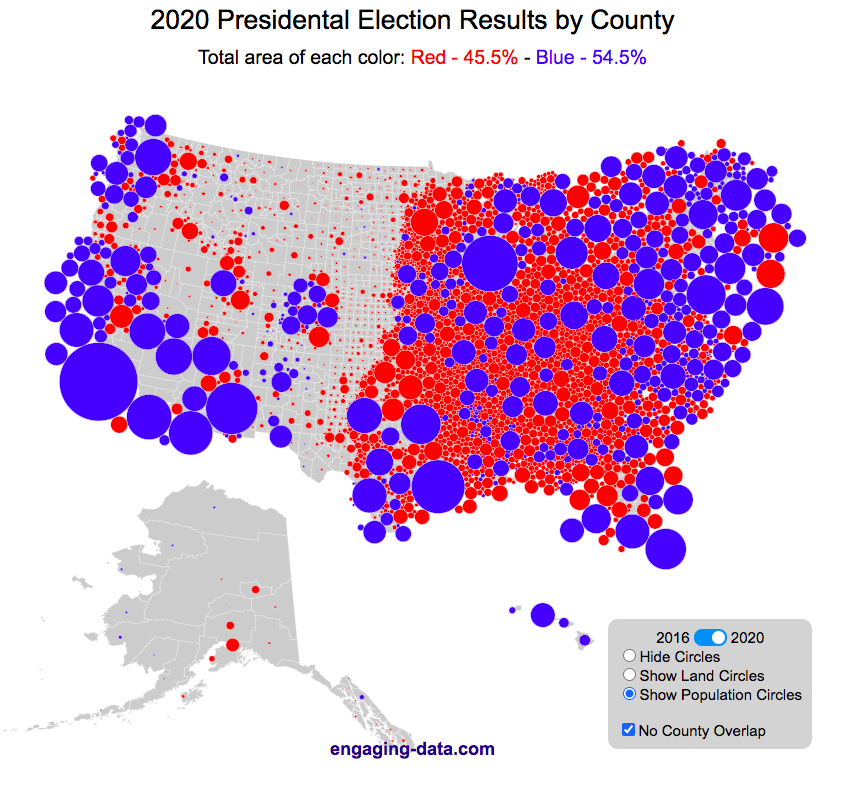

# Objectifs du module

À la fin de ce module, vous devriez être capable de :

- Identifier des problèmes éthiques dans une visualisation.
- Anonymiser correctement des données.
- Appliquer les bonnes pratiques de visualisation pour représenter les données de manière claire et honnête.
- Identifier et éviter les biais de présentation des données.
- Comprendre les enjeux éthiques et de confidentialité liés à la science des données.
- Mettre en place des mesures de protection et de sécurisation des données sensibles.
- Expliquer les principes CRAP.
- Expliquer les principes FAIR.

# Lectures

Pour vous préparer, consultez les ressources suivantes :

-    [R for Data Science — Communication](https://r4ds.hadley.nz/communication.html)
-    [Guide de bonnes pratiques à l’usage des data scientists (gouvernement du Luxembourg)](https://mindigital.gouvernement.lu/dam-assets/publications/guide-manuel/guide-data-scientists/fr-guide-de-bonnes-pratiques.pdf)

# Aventure

Vous incarnerez un·e **expert·e en éthique des données** et serez chargé·e d’évaluer un rapport problématique.\
Lien vers l’aventure :\
 [Aventure 7 — Visualisation, éthique et sécurisation des données](aventure.qmd)

# Défi — Analyse éthique et visualisation responsable {.unnumbered}

Vous recevrez un jeu de données COVID simulé. Votre tâche sera de produire une analyse responsable :

-   Évaluer les aspects éthiques liés à la visualisation fournie.
-   Anonymiser correctement les données.
-   Créer une nouvelle visualisation fidèle et informative.
-   Rédiger une réflexion critique sur les enjeux rencontrés.

# Exercices de consolidation {.unnumbered}

Voici quelques exemples réels de visualisations problématiques ou controversées à analyser :

1.  **Fox News – Graphique sur le christianisme aux États-Unis**\
    La chaîne a diffusé un graphique avec un axe Y tronqué, exagérant visuellement une baisse du taux de chômage.

    

    **Question** : En quoi la forme de l’axe trompe-t-elle le lecteur ? Comment le représenter honnêtement ?

2.  **USA Today – Diagramme circulaire erroné**\
    Le graphique totalise plus de 100 % de parts, rendant la visualisation incohérente.

    \
    **Question** : Que montre cette erreur ? Quels types de graphiques alternatifs conviendraient mieux ?

3.  **Cartes électorales américaines – Distorsion par surface**\
    Les grandes zones rurales peu peuplées sont visuellement dominantes sur les cartes, même si elles comptent peu d’électeurs.

    \
    **Question** : Pourquoi la taille géographique peut-elle fausser la perception des résultats ? Comment faire mieux ?

4.  **Ticked Axis – Exemple pédagogique de manipulation**\
    Deux versions d’un même graphique, l’une honnête et l’autre manipulée par troncature d’axe, révèlent l’impact des choix visuels.

    \

    {alt="Lesson 3: Apply the Information | Critical Thinking Course | Learn ..."}\
    **Question** : Que remarquez-vous en comparant les deux versions ? Quels messages différents sont véhiculés ?

5.  **Cambridge Analytica – Profilage psychologique sans consentement**\
    Données Facebook utilisées à l’insu des utilisateur·rices à des fins de manipulation électorale.\
    <https://fr.wikipedia.org/wiki/Cambridge_Analytica>\
    **Question** : Quels principes éthiques sont ici violés (transparence, consentement, anonymisation) ? Comment prévenir ce type de dérive ?
